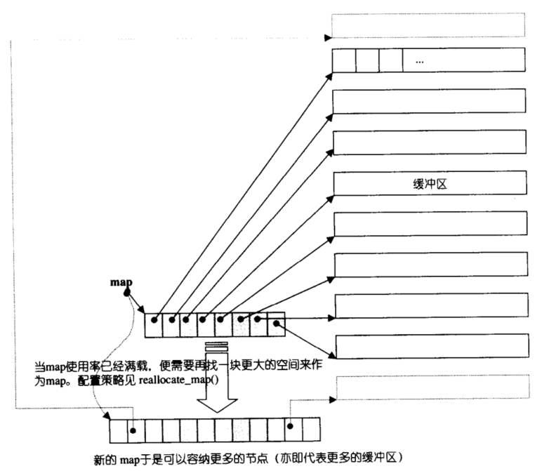
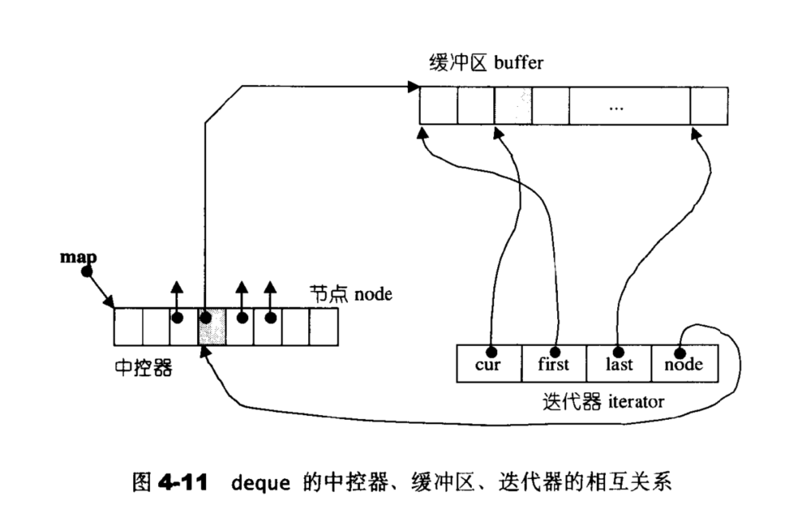
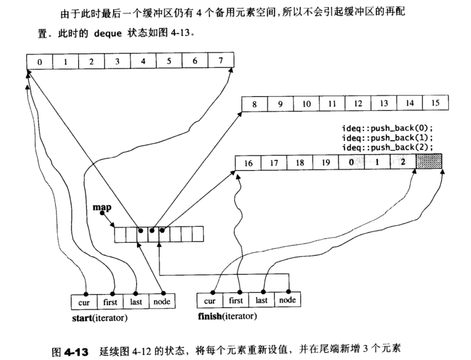
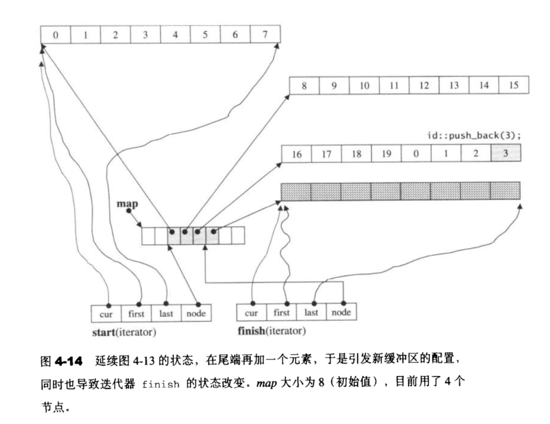
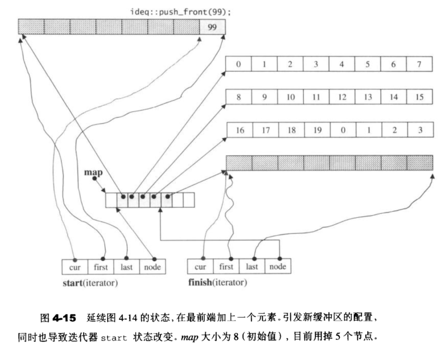

## STL六大组件

-   容器（Container）
    -   vector、list、deque、set、map等
-   算法（Algorithm）
    -   sort、find、copy等
-   迭代器（Iterator）
    -   类似指针
-   仿函数（Function object）
    -   扮演函数行为的类叫做仿函数
-   适配器（Adaptor）
    -   stack与queue就是适配器，而不是容器，因为它们是对容器的再封装
-   空间配置器（allocator）
    -   alloc，负责配置空间与管理

## 快速浏览

​	1.vector 底层数据结构为数组 ，支持快速随机访问

​	2.list  底层数据结构为**环状双向链表**，支持快速增删，对于任意一个位置元素的删除、插入时间复杂度都是O(1)

​	3.deque  底层数据结构为一个**中央控制器和多个缓冲区**，其空间是**分段连续**的，其中缓冲区是真正储存数据的地方，中央控制区储存指向缓冲区的各个指针，支持首尾（中间不能）快速增删，也支持随机访问

​	4.stack  底层一般用2，3实现，封闭头部即可，不用vector的原因应该是容量大小有限制，扩容耗时

​	5.queue  底层一般用2，3实现，封闭头部即可，不用vector的原因应该是容量大小有限制，扩容耗时

​	6.4，5是适配器（adaptor）,而不叫容器（container），因为是对容器的再封装

​	7.priority_queue 的底层数据结构一般为vector为底层容器，**堆heap为处理规则**来管理底层容器实现

​	8.set底层数据结构为红黑树，有序，不重复

​	9.multiset 底层数据结构为红黑树，有序，可重复

​	10.map底层数据结构为红黑树，有序，不重复

​	11.multimap 底层数据结构为红黑树，有序，可重复

​	12.unordered_set 底层数据结构为hash表，无序，不重复

​	13.hash_multiset 底层数据结构为hash表，无序，可重复

​	14.unordered_map   底层数据结构为hash表，无序，不重复

​	15.hash_multimap 底层数据结构为hash表，无序，可重复

## vector

-   原理：vector的底层实际上就是一块连续的地址空间，该地址空间有3个指针（迭代器）：
    -   `iterator start` //表示目前已使用空间的头
    -   `iterator finish` //表示目前已使用空间的尾
    -   `iterator end_of_storage` //表示目前可用空间的尾
-   运用好这3个迭代器，就能够实现vector几乎所有功能：

```c++
template<class T, class Alloc = alloc>;
class vector{
public:
    iterator begin(){return start;}
    iterator end(){return finish;}
    size_type size(){return size_type(end() - begin());}
    size_type capacity() const{
        return size_type(end_of_storage - begin());
    }
    bool empty const{return begin() == end();}
    reference operator[](size_type n){return *(begin() + n);}
    reference front(){return *begin();}
    reference back(){return *(end() - 1);}
    ...
};
```

-   [vector扩容](https://blog.csdn.net/gettogetto/article/details/77804094?utm_medium=distribute.pc_relevant.none-task-blog-2~default~BlogCommendFromMachineLearnPai2~default-1.vipsorttest&depth_1-utm_source=distribute.pc_relevant.none-task-blog-2~default~BlogCommendFromMachineLearnPai2~default-1.vipsorttest)/string扩容有了解过吗？
    -   发生场合：当使用push_back向vector尾部加入一个新元素时，当超过了vector目前的最大容量时，就会发生扩容。
    -   扩容大小：一般有2倍扩容与1.5倍扩容，扩容因子越大，那么意味着预留空间越大，浪费空间越多，但是如果扩容因子过小，就会时常产生预留空间不足，那么就会频繁的重新开辟一段空间，把原有数据复制到新空间上，并释放原空间。这个时间成本极大。因此，扩容因子的取值权衡了空间与时间的优化。
-   **序列式容器**（数组式容器，包括vector、deque）迭代器失效
    -   insert插入操作，若引起空间的重新分配即插入的元素无法被已有的容器容纳而造成的空间重分配时，原来的迭代器会指向无效的地址空间从而造成迭代器的失效。
    -   erase删除操作，由于删除元素而带来的元素向前迁移，会导致当前迭代器及以后所有的迭代器失效。

## list

### 数据结构与特点

-   list  底层数据结构为**环状双向链表**，支持快速增删，对于**任意一个位置**元素的删除、插入时间复杂度都是O(1)

### 节点数据结构

-   由于是双向链表，因此节点中包含next指针、prev指针、data3个数据

### 迭代器

-   重要性质：与vector不同，list迭代器在插入（insert）、接合（splice）都不会造成原有的list迭代器失效，而vector的插入操作会使得原有的迭代器全部失效，甚至list的删除操作（erase），也只有指向“被删除元素”的那个迭代器失效，其他迭代器不受影响

### 成员函数

-   由于list是一个双向链表，因此只需要一个指针，就可以表示整个环状双向链表，这个指针node指向list尾部刻意增加的一个空白节点（即不储存数据），那么以下几个成员函数就可以轻松实现：

```c++
iterator begin() { return (line_type)(*node.next);}
iterator end() { return node;}
bool empty() { return node == node->next;}
reference front() { return *begin();}
reference back() { return *(--end());}
```

### 内存管理

-   iterator insert(iterator position, const T& x)
    -   借助该成员函数，可以实现头插、尾插功能：

```c++
void push_front(const T& x) {insert(begin(), x);}
void push_back(const T& x){insert(end(), x);}
```

-   iterator erase(iterator position)
    -   借助该成员函数，可以实现头删、尾删功能：

```c++
void pop_front() {erase(begin());}
void pop_back(){
    iterator tmp = end();
    erase(--tmp);
}
```


## deque

### 数据结构

-   deque  底层数据结构为一个**中央控制器和多个缓冲区**，其中缓冲区是真正储存数据的地方，中央控制区储存指向缓冲区的各个指针，支持首尾（中间不能）快速增删，也支持随机访问

### 特点

-   deque空间是**分段连续**的，因此相比于vector来说，没有**容量（capacity）**这一说，也没有必要存在**空间保留（reserve）**功能
-   由于deque是分段连续的，因此需要有一个**中控器（map）**来实现对deque的中央控制，实际上这个map是一小块**连续**线性空间，其中的每个元素（称之为节点）都储存着指针，这些指针指向很多段连续的线性空间，称为**缓冲区**，缓冲区才是deque储存空间的主体
    -   在g++中我们可以设置缓冲区大小：`deque<int, alloc, 8> //设置缓冲区大小为8个字节`



### 迭代器

不同于vector的迭代器，deque的迭代器有多个对象（实际上它是一个类），常用如下：

-   T* cur：该迭代器所在缓冲区中当前的元素指针，数据类型为T*，是一个模板，可为int，float，double...
-   T* first：指向该迭代器所在缓冲区的头
-   T* last：指向该迭代器所在缓冲区的尾
-   map_pointer node：node指向的是中控器的当前缓冲区

>   注意：当迭代器运行到了缓冲区边缘，就要判断是否利用set_node(node + 1)函数切换到下一个节点（下一个缓冲区），具体是：当最后一个缓冲区存在 < 2个可用空间时，就会开辟新的缓冲区



### 成员函数

下面介绍deque常用的成员变量：

-   iterator **start**: //迭代器，指向第一个**节点**
-   iterator **finish**：//迭代器，指向最后一个**节点**
-   map_pointer **map**
-   size_type **map_size**:记录map大小，即有多少个指针
-   上述成员变量使得deque常用成员函数实现变得十分简单：begin()、end()、front()、back()、size()、empty()

### 内存管理（非常重要）

-   尾插：push_back(val)函数
    -   当最后一个缓冲区有 >=2个备用空间，则将val插入备用空间
    -   否则就会开辟一个新的缓冲区





-   头插：push_front(val)函数
    -   当第一个缓冲区还有备用空间，直接在备用空间上构造元素
    -   否则开辟新的缓冲区



-   pop_back()
    -   当最后一个缓冲区只有一个元素时，调用pop_back()，会释放该缓冲区，pop_front()同理
-   引起map重新开辟空间、复制原map值、释放原空间的2种情况：
    -   当map的尾端的节点备用空间不足时，即调用push_back(val)，增加缓冲区，但是发现map尾节点已经有其他数据了
    -   当map的头部的节点备用空间不足时，即调用push_front(val)，增加缓冲区，但是发现map头节点已经有其他数据了
-   利用erase()与insert()函数删除deque中间元素时，都会使短的一端所有元素向前/向后移动一格，因此复杂度是O(n)

## string

-   改进：C中的char* a[] = "abcde"不允许扩容，否则会出现数组越界的情况。C++中，包括vector与string，都可以动态申请内存。即：当长度超过了它的容量capacity时，它就会在内存中重新寻找一段连续内存，经过实验，得出扩容大小与vector相同，都是之前的1.5倍

## unordered_map

-   底层实现：哈希表
-   哈希表原理是什么？ 实现键值对的一一映射
-   怎样通过关键字找到相应的值呢？/怎样构造hash函数？

    -   除留余数法（最常用的构造方法）

        -   address(key) = key % p (p <= m， 其中m为表长)

        -   一般来说，需要把p取成接近m的质数，因为质数没有多余的因数。

    -   直接定址法

        -   address(key) = a * key + b

        -   用处：用在对一些关键字连续的情况

    -   数字分析法

        -   场合：关键字key比较大，并且关键字分布比较均匀

        -   分析这些关键字，哪一部分是完全不同的，比如手机后4位，那么用这个作为address(key)

    -   平方取中法

        -   对关键字先平方，再取中位数

        -   场合：关键字位数不大
-   哈希冲突

    -   什么是哈希冲突？
        -   不同的关键字对应到了相同的地址值，那么前一个关键字的值会被后一个关键字的值覆盖掉，导致前面的关键字对应的值丢失的一种情况

    -   怎样解决？

        -   开放定址法（线性探测法、二次探测法、随机探测法）

            -   原理：一旦地址发生冲突，那么就去寻找下一个空的散列地址。

            -   f(key) = (f(key ) + di) % m (di = 1, 2, ... m - 1)

            -   缺点：容易出现堆积现象（不是同义词的两个关键字争夺同一个地址的情况）

            -   改进：二次探测：(di = 1, -1, 2^2, -2^2 ..)(不让关键字集中在某个区域) 随机探测法
        -   再散列函数法
        
            -   原理：存放多个hash函数，出现hash冲突，那么就换另一个函数
        
            -   缺点：增加了计算时间
        -   链地址法

            -   原理：将存在hash冲突的所有关键字用一个链表来存放，那么在对应的地址上只存放这个链表的指针

            -   优点：可以保证一定不会出现堆积现象

            -   缺点：单链表遍历耗费资源
        -   公共溢出区法
        -   原理：对于所有出现hash冲突的关键字，统一找一个区域保存（叫做公共溢出区）
-   hash表性能受哪些因素影响？
    1.  散列函数是否均匀
    2.  处理冲突的方法
        -   比如说，线性探测容易产生堆积现象，显然没有二次探测性能好，而链地址法处理冲突不会产生任何堆积，因此平均查找性能更加
    3.  散列表的装填因子
        -   装填因子alpha = 填入表中的记录个数 / 散列表表长，显然，装填因子越大，冲突发生概率越大，因此不管你记录个数n多大，我都可以找到一个表长m，使得n / m维持在一个较为小的值，使得冲突明显降低。这样虽然牺牲了一些额外空间，但总的来说是值得的。

>   理想状态下，hash表查找效率最高，为O(1)，但是受到哈希冲突影响，因此hash表性能可能达不到O(1)

## priority_queue

-   实现：利用堆结构进行实现

-   [堆的具体实现](https://guguoyu.blog.csdn.net/article/details/81283998?utm_medium=distribute.pc_relevant_t0.none-task-blog-2~default~BlogCommendFromMachineLearnPai2~default-1.vipsorttest&depth_1-utm_source=distribute.pc_relevant_t0.none-task-blog-2~default~BlogCommendFromMachineLearnPai2~default-1.vipsorttest)：

    -   具体来说分为两个部分：堆的初始构建、堆的插入、堆的删除

    -   堆的初始构建：假设给的数组是完全二叉树的层序遍历，那么它最右下角拥有孩子节点的节点的idx是(n - 1) / 2，从该节点开始一直到根节点，如果父节点 < 两个孩子节点中的最大值，那么就与孩子节点交换，直到叶子节点为止。这样从右下节点一直到根节点遍历一遍，那么会使得每个父节点都是>=它所有的孩子节点。复杂度是O(nlogn)

    -   插入元素：首先将新元素作为堆的最后一个节点（即二叉树最底层最右侧节点），然后一层一层的寻找父亲，并交换节点使得父节点值最大，直到达到根节点，复杂度：O(logk)其中k是插入元素后堆大小

    -   删除元素：首先将根节点弹出，然后将堆的最后一个节点放到根节点上，一层一层的遍历，让父亲节点最大，最终到达叶子节点为止，复杂度：O(logk)其中k是删除元素后堆的大小
    
-   [建立、插入、删除堆元素](https://blog.csdn.net/SZU_Crayon/article/details/81812946?utm_medium=distribute.pc_relevant.none-task-blog-2~default~BlogCommendFromBaidu~default-18.vipsorttest&depth_1-utm_source=distribute.pc_relevant.none-task-blog-2~default~BlogCommendFromBaidu~default-18.vipsorttest)

    

## map/set

-   底层实现：红黑树，查找/删除节点的时间复杂度：O(logn)
-   为什么要用红黑树？红黑树是一种平衡二叉树。
-   那平衡二叉树有什么优点？平衡二叉树查找元素的最坏时间复杂度也是O(logn)，克服了二叉搜索树因退化成链表而致使的搜索时间复杂度变成O(n)这一情况
-   为什么有了平衡二叉树还需要红黑树？因为平衡二叉树的条件过于严苛：所有节点的左右子树的高度差不超过1，这使得在插入/删除节点后几乎都会破坏该规则，进而需要我们左旋、右旋来调整，对于频繁插入、删除的场景来讲，平衡二叉树的性能大大降低，为了解决这个问题，于是出现了红黑树。
-   红黑树引入了颜色概念，使得平衡条件得以简化，降低了对旋转的要求，从而提高了性能

