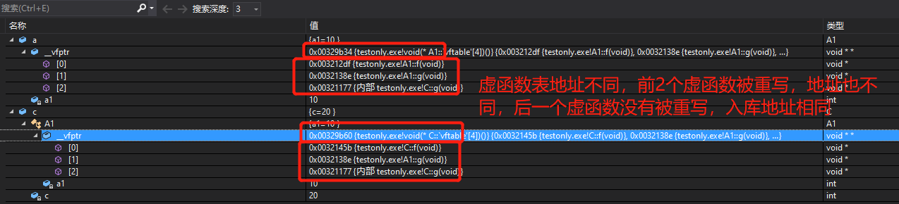
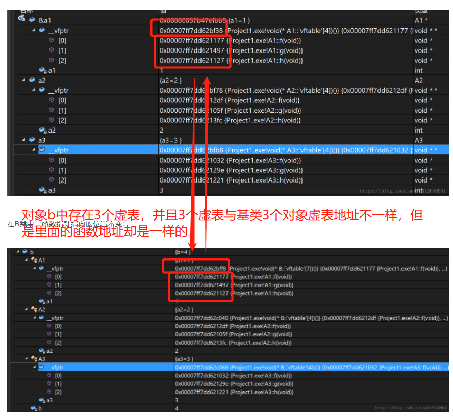
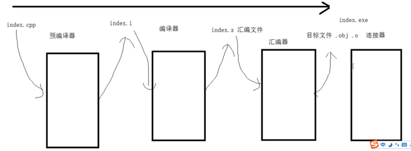
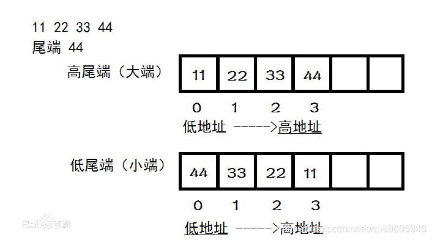

## 简述一下面向对象与面向过程之间的区别

-   面向过程编程：分析出解决问题的步骤，然后一步一步实现

-   面向对象编程：将待解决问题抽象、分解成各个对象，用于描述这些对象在解决这个问题的行为

-   例子：五子棋编程

    -   面向过程：黑先走、绘制画面、判断输赢、白再走、绘制画面、判断输赢...

    -   面向过程：

        -   黑白棋子：行为一样，可以八邻域走

        -   棋盘对象：负责绘制画面

        -   规则系统：犯规、输赢

## [面向对象与面向过程之间的优缺点](https://blog.csdn.net/jerry11112/article/details/79027834?ops_request_misc=%7B%22request%5Fid%22%3A%22161796107416780265480175%22%2C%22scm%22%3A%2220140713.130102334..%22%7D&request_id=161796107416780265480175&biz_id=0&utm_medium=distribute.pc_search_result.none-task-blog-2~all~sobaiduend~default-1-79027834.first_rank_v2_pc_rank_v29&utm_term=面向对象与面向过程&spm=1018.2226.3001.4187)

-   面向对象：

    -   优点：易维护、易复用、易扩展，由于面向对象有封装、继承、多态性的特性，可以设计出低耦合的系统，使系统更加灵活。

    -   缺点：性能比面向过程低

-   面向过程：

    -   优点：性能比面向对象高，因为类调用时需要实例化，开销比较大，比较消耗资源;比如单片机、嵌入式开发、 Linux/Unix等一般采用面向过程开发，性能是最重要的因素。

    -   缺点：没有面向对象易维护、易复用、易扩展

## 利用面向对象思路设计类

-   给你圆、三角形、正方形 等等形状，利用面向对象的思想，简述你设计的流程，步骤：
-   定义一个shape父类，里面有面积、周长成员变量，并且有面积、周长计算虚函数
-   定义各个子类继承父类，子类重写父类的面积、周长计算函数，并且子类中含有子类独特的成员变量，比如说圆多加了r

## static关键字（5大用途）

-   加在全局变量（函数外声明的变量）上：

    -   作用域：从定义之处开始，到文件结尾

    -   作用：全局变量不允许被其他文件所引用extern

-   加在局部变量上：

    -   作用域：仍是局部作用域，离开定义它的函数或者语句块时，作用域结束

    -   但是作用域结束后不会被释放，而是保存在静态存储区中，等待下次函数的调用，并且值不变

-   加在函数上：
    -   变成静态函数， 只在声明它的文件中可见，不允许被其他文件引用extern

-   类的静态成员变量：有时候我们需要这一类的所有对象都有一个共同的变量

    -   这个类的所有实例/对象都共用着这个变量
    -   可以通过任意对象修改这个静态成员变量，这时候其他对象里面对应的静态变量也会跟着修改（因为它们共享一个静态变量）
    -   可以通过两种方式来访问该变量
    -   **静态变量需要在类内声明，类外定义**
        -   原因：static修饰的变量先于对象存在，所以static修饰的变量要在类外初始化（实际上，non-local static对象都先于main函数被创建出来）
    
-   类的静态成员函数：

    -   一般用于修改类的静态变量
    -   不允许修改普通成员变量的值

>   由于static修饰的类成员属于类，不属于对象，因此static类成员函数是没有this指针的，this指针是指向本对象的指针。正因为没有this指针，所以static类成员函数不能访问非static的类成员，只能访问 static修饰的类成员。

## C++程序内存分为哪几个部分？


## const关键字

-   const关键字修饰全局变量：存储在**只读数据段？**，编译期最初将其保存在符号表中，第一次使用时为其分配内存，在程序结束时释放
-   const关键字修饰局部变量：储存在栈中
-   ==未解决==：什么是符号表，它与栈帧之类的东西究竟有什么关系

## 堆、栈的详细区别

-   在内存中的堆栈：
    -   维护方式：
        -   栈：由系统进行维护，在程序执行时保存程序内的局部变量，在程序结束后，栈内的变量会自动被释放
    
        -   堆：由程序员进行维护，程序员可以用malloc或者new关键字申请任意大小的内存，最后用free或delete关键字释放相应内存，如果没有释放，则操作系统将会在程序结束后自动回收。如果没有用free或delete关键字释放容易造成内存泄露。
    -   空间不同：

        -   栈：是向低地址扩展的，空间是连续的，但是空间比较小，系统**默认栈空间是2M**，没有内存碎片

        -   堆：是向高地址扩展的，空间是不连续的，用一个**空闲块链表**来维护，堆大小受制于计算机内有效的虚拟内存，相比于栈而言空间较大，较为灵活，但是容易产生内存碎片
    -   效率不同：

        -   栈：由系统自动分配，效率较高
    -   堆：由程序员new / malloc分配，效率较低

-   数据结构中：
    -   堆：一种以特殊规则构成的二叉树。
    -   栈：也是一种数据结构，满足后进先出
-   结论：个人认为内存中的堆与栈和数据结构中的堆与栈没有什么关联

## C++与C不同的地方

-   C++是面向对象，C是面向过程

-   C++的三个特性：封装、多态、继承

-   C++支持范式编程，即模板类、函数模板

## cast4种类型转换

-   static_cast

    -   基本类型转换

    -   void指针转换为目标类型指针

    -   void指针：由于void指针没有特定类型，因此它可以指向任何数据类型

-   const_cast

    -   可以通过const_cast修改const类型变量

    -   

-   dynamic_cast

    -   将基类指针转换为派生类指针或者同级兄弟指针

    -   与static_cast区别：static_cast无法进行同级转换

-   reinterpret_cast
    -   几乎什么类型都可以转换

## 指针与引用的区别

-   指针里面保存的是变量的地址，引用是变量的别名，对变量进行操作，指针必须解引用

-   指针占用实际内存空间，而引用只是一个别名，不占用内存

-   利用sizeof查看指针的大小是4，而用sizeof查看引用则取决于变量类型，char 1个字节，short是2字节， int /long/float占4个字节，long long /double 8个

-   一个指针可以指向其他对象，但是一个引用只是一个对象的引用，不能被改变

-   指针有多级指针

## 智能指针有哪些？并介绍一种你最熟悉的智能指针

-   **shared_ptr**
    -   为什么要有shared_ptr指针？
        -   在动态内存管理时，当有多处引用相同的内存块时，我们不知道什么时候该释放指针所指的内存块，所以才引入智能指针。智能指针将指针经过封装，通过**引用计数**(use_count)来防止内存泄露。当指向一个内存块的智能指针数为0时，那么智能指针会自动释放相应的内存，防止内存泄露。
    
    -   shared_ptr为什么能做到计数呢？/use_count()怎样实现的？
        -   shared_ptr实际上是一个类，当shared_ptr对象离开了作用域时，就会调用析构函数，将它的引用计数- 1，如果引用计数为0，它会使用delete函数删除该内存
    
    -   shared_ptr引用计数失效的情况：相互引用
    
        -   定义两个类，每个类中又包含指向另一个类的shared_ptr，那么让它们相互引用，就会造成引用计数失效
    
        -   引用链如下：当出了test_refer_to_each_other时，ptr_a与ptr_b销毁，CA与CB的引用数--，即①与③断开，但是仍然有相互引用链②与④，因此引用计数仍不为零，无法析构
        -   
    
    -   解决相互引用问题：利用weak_ptr指针
    
        -   将其中两个类中其中一个成员变量设为weak_ptr
    
        -   原因：weak_ptr不增加引用计数值，即CA的use_count() == 1，那么析构ptr_a与ptr_b后，CA的引用计数器变成了0，delete CA对象，那么m_ptr_b也会调用析构函数，使得CB引用计数器也变为了0，最后不会形成循环引用环
        -   
    
    -   与unique_ptr有什么不同的地方？
        -   unique_ptr只允许一个指针指向一个对象，而shared_ptr实现多个智能指针指向一个相同的对象，详见：[3种智能指针解析](https://blog.csdn.net/king_way/article/details/95536938)
    
    -   其他示例： [shared_ptr 详解与示例](https://blog.csdn.net/shaosunrise/article/details/85228823?ops_request_misc=%7B%22request%5Fid%22%3A%22161959385616780265440635%22%2C%22scm%22%3A%2220140713.130102334.pc%5Fall.%22%7D&request_id=161959385616780265440635&biz_id=0&utm_medium=distribute.pc_search_result.none-task-blog-2~all~first_rank_v2~hot_rank-4-85228823.first_rank_v2_pc_rank_v29&utm_term=shared_ptr&spm=1018.2226.3001.4187)
    
-   unique_ptr

-   weak_ptr

## 智能指针有没有内存泄漏的情况？

-   有，相互引用，见上

## 野指针

-   指向一个未知地址空间的指针就是野指针

-   产生原因：

    -   指针定义时，未被初始化

    -   指针指向的对象被销毁时，指针又没有被赋成NULL时

-   避免：在初始化指针的时候将指针设为NULL，释放指针时将指针设为NULL

## 多态/继承/虚函数

1.   什么是多态？

     -   多态就是多种形态，包括静态多态与动态多态

         -   静态多态：静态多态就是**函数重载以及运算符重载**

             -   函数重载：函数名相同，形参的数量、位置、参数类型不一样代表不同的函数。由于在编译时就可以确定函数入口地址，因此是静态多态。
             -   运算符重载：实现自定义数据类型的+、-、*、/、<<、++、关系运算符等
         
         -   动态多态：派生类对基类虚函数的一种实现叫做动态多态。在基类的函数前面加上virtual关键字，变成**虚函数**，那么在派生类中可以**重写**该函数，运行时会根据对象的实际类型来调用相应的函数，即基类指针如果指向的是基类调用的就是基类的函数，指向派生类调用的就是派生类中被重写的函数。运行时在虚函数表中寻找调用函数的地址。因此是动态多态。
         
             

2.  多态的底层原理是什么？

    -   利用虚函数表来实现多态。实现基类对象的指针指向基类对象时，调用的是基类对象的析构函数；指向派生类对象时，调用的是派生类对象的析构函数。

3.   什么是虚函数？什么是虚析构函数？为什么要有这种东西？

     -   虚函数：虚函数的由来是为了实现多态。在基类的函数前面加上virtual关键字，变成虚函数，那么在派生类中可以重写该函数，运行时会根据对象的实际类型来调用相应的函数，即指向父类调父类，指向子类调子类的多态表现。
     -   虚析构函数：需要将基类析构函数定义成虚析构函数。由于基类指针可以指向派生类对象，那么此时当用delete删除基类指针时，会先析构子类，而析构子类后需要析构父类，因此将子类与父类都析构了，这样就不会造成内存泄露。如果不把父类的析构函数定义成虚析构函数，那么就不会发生动态绑定（即不会通过虚函数表来寻找），由于是delete关键字作用的是父类指针，因此只会调用父类析构函数，不会调用子类析构函数，这样就会造成子类的“局部销毁”情况发生，通常是子类继承父类的变量被正确析构，但是子类自身的成员变量不能被正确析构，最终造成内存泄漏。

4.  为什么c++默认析构函数不是虚函数呢？

    -   因为虚函数的创建需要额外的虚函数表与虚表指针，占用额外内存，对于一些不会被继承的类来说，析构函数定义成虚函数反而会浪费内存。因此只有发生继承关系时，才将基类的析构函数变成虚析构函数, [附博文](https://blog.csdn.net/qq_40840459/article/details/80195158?utm_medium=distribute.pc_relevant.none-task-blog-2~default~BlogCommendFromMachineLearnPai2~default-2.baidujs&dist_request_id=&depth_1-utm_source=distribute.pc_relevant.none-task-blog-2~default~BlogCommendFromMachineLearnPai2~default-2.baidujs)

## 什么是纯虚函数？什么是抽象类？

-   纯虚函数：父类的虚函数一般都是被子类重写，父类虚函数的实现多数情况下没有意义。因此偷个懒，不写父类的虚函数实现，直接用virtual fcn() = 0;表示这是纯虚函数，只有函数声明，没有实现，留着给子类去重写。
-   注意：纯虚析构函数与纯虚函数有些许不同，它既有声明virtual ~base() = 0;也有实现，不过实现需要用类外实现。这是因为，父类中也有可能在堆中开辟内存，需要用析构函数释放干净。
-   抽象类：具有至少一个纯虚函数的类叫做抽象类，一般抽象类只是用来当做接口，用于为子类提供基础的成员变量去继承，注意：**不允许实例化抽象类对象**，否则会报错

## 重载、重写（覆盖）、重定义（隐藏）的区别

-   **重载**：一般指的是函数重载，指的是：在同一个作用域下、多个函数取相同名字、但是形参列表不同，代表不同的函数。这使得我们可以把完成类似功能的不同函数可以统一命名。由于这个操作在编译前就已经确定了函数入口地址，因此重载也叫作静态多态。（**重载不关心函数的返回类型**，即
    -   void fcn(int a)
    
    -   int fcn(int a)这两个函数不是重载！是不允许通过编译的！
    
-   **重写**：指的是派生类覆盖了与其同名的基类函数。在基类的成员函数前面填上virtual关键字，变成虚函数，那么在派生类中就可以重新定义这个函数。
    -   两者区别：
    
        -   范围不同：重载是在同一个类中，而重写在不同类中，分别是基类与派生类
    
        -   参数区别：重写与被重写的函数参数列表一定相同，重载和被重载函数参数列表一定不同
    
        -   virtual区别：重写的基类必须要有virutal修饰，而重载函数可以被virtual修饰，也可以没有
-   **重定义**： 指的是派生类隐藏了与其同名的基类函数。指的是派生类出现了一个与基类名字相同的函数（形参列表与返回值不被关注），那么派生类函数就把基类函数隐藏了
-   **区别**：当派生类中的同名函数返回值、形参列表、函数名与基类都相同，并且基类中的函数有virtual关键字修饰，那么就是重写，否则就是重定义

## 访问权限：public private protected区别

-   public：能够被类内成员函数进行访问，类外（用户代码）也可以进行访问

-   protected：能够被派生类对象、友元进行访问，但是不允许被用户代码（类外）访问

-   private：仅仅只有类内成员函数、类外友元才能够访问，**派生类无权访问**

-   拓展：public、protected、private继承有什么区别吗？

    -   public继承：基类public、protected成员在子类中权限不变，但是子类无权访问基类private权限成员。

    -   protected继承：基类的public与protected成员在子类中变成了protected权限，子类仍然无权访问基类private权限成员。

    -   private继承：基类的public与protected成员在子类中变成了private权限，子类还是无权访问基类private权限成员。

    -   

## 什么是构造函数？什么是析构函数？

-   构造函数：用来对类进行实例化，即初始化对象
-   析构函数：当对象已经出了其作用域，那么利用析构函数就会释放构造函数所申请到的空间，防止内存泄露

## 析构函数调用的3种情况？

-   对象出了作用域，生命周期结束
-   主动调用delete关键字来释放指着所指的对象
-   对象i是对象o的成员，o析构时，对象i也跟着析构

## 一个类中包含了特殊的另一个类的成员，那么构造、析构顺序怎样？

-   设类A中存在类B的对象。构造：先调用类B的构造函数，再调用类A的构造函数，析构相反。

## 基类与派生类的构造函数是什么样的关系？

-   结论：总是先调用基类构造函数，再调用派生类构造函数。

-   原因：因为基类中private变量对于派生类来说是不可访问的，因此是不允许在派生类构造函数中直接初始化基类的private变量的。但是派生类又继承了基类的private变量，为了解决这个矛盾，所以每次调用派生类构造函数时，派生类构造函数中调用基类构造函数，委托基类去初始化基类成员变量（有委托构造函数那味儿了）

-   注意：

    -   派生类中只能调用直接基类的构造函数，不能调用间接基类的构造函数，因为间接基类的构造函数会在直接基类的构造函数中被调用，如果在派生类中再次调用，那么不仅仅是无意义的操作，还会消耗不必要资源。

##  如果一个子类继承了多个父类，那么析构子类的时候顺序是怎样的呢？

-   由于类的构造与析构的顺序是相反的。因此先析构子类，然后根据子类构造函数调用父类构造函数的顺序，反着调用各个父类析构函数

## 构造函数可以被继承吗？析构函数可以被继承吗？

-   答：不可以。
-   如果子类继承了构造函数，由于父类与子类的类名一定不同，那么继承来的构造函数名与子类类名也不同，这就违背了构造函数需要与类名相同这一原则
-   子类一般通过借助父类的构造函数来初始化父类的成员变量，但如果构造函数被继承，那么子类就能够直接通过子类构造函数来初始化父类的private变量，这与C++的“封装”思想相违背。

## 构造函数可不可以是虚函数？为什么？

-   不可以。因为虚函数是在虚函数表中查找得到的，由于虚函数表在内存的静态存储区==（存疑）==，因此在查找前需要对虚函数表进行初始化操作。而构造函数就是为了初始化成员变量而存在的。如果把构造函数变成虚函数，那么在之前成员变量都没有被初始化，也就无从找到虚函数的入口地址了。

## 构造函数可不可以是private访问权限？为什么？

-   除了单例模式外，构造函数不可以是private访问权限。因为对象需要调用构造函数，如果是private访问权限，那么根据private定义：类外代码无权访问，那么就无法调用构造函数初始化对象的成员变量了。

## 构造函数可以被重载吗？析构函数呢？

-   构造函数由于可以输入参数不同，因此可以发生重载，包括默认构造函数（参数列表为空）， 自定义的构造函数、拷贝构造函数、委托构造函数等等。
-   析构函数由于它的参数列表为空，而函数重载只关心参数列表是否相同，而不关心返回值，因此不允许进行重载。

## ==[有了解过虚函数表与虚表指针吗？](https://blog.csdn.net/u012630961/article/details/81226351?utm_medium=distribute.pc_relevant.none-task-blog-2~default~BlogCommendFromMachineLearnPai2~default-2.baidujs&depth_1-utm_source=distribute.pc_relevant.none-task-blog-2~default~BlogCommendFromMachineLearnPai2~default-2.baidujs)==

-   虚函数表：存放虚函数的入口地址的表叫做虚函数表，由于虚函数表存放地是在静态存储区，因此在编译时期已经创建好了虚函数表
-   虚表指针：指向虚函数表的指针叫做虚表指针，假设类B继承了父A1、A2、A3，那么类B中就有3个虚表指针，分别指向3个虚函数表
-   位置：虚函数表是存放在内存的静态存储区中
-   单继承：
    -   继承含有虚函数的父类的子类会同样在子类对象中构造出一个虚函数表，这个虚函数表和基类的虚函数表不是一个表（无论派生类有没有重写基类的虚函数），但是如果派生类没有重写基类的虚函数的话，基类和派生类的虚函数表指向的函数地址都是相同的。
    -   这就解释了为什么子类重写父类虚函数，利用父类指针指向子类对象，调用函数时，编译器知道调用的是子类重写过函数，而不是父类的虚函数，因为子类在继承了父类时，已经拷贝了一份虚函数表并且将里面对应的虚函数地址改成了子类重写过后的函数地址了
    -   如果单继承，子类中又定义了一些虚函数，那么这些虚函数也放在子类虚函数表中，只不过放到了虚函数表的后面

```c++
class A1
{
public:
    A1(int _a1 = 1) : a1(_a1) { }
    virtual void f() { cout << "A1::f" << endl; }
    virtual void g() { cout << "A1::g" << endl; }
    virtual void h() { cout << "A1::h" << endl; }
    ~A1() {}
private:
    int a1;
};
class C : public A1
{
public:
    C(int _a1 = 1, int _c = 4) :A1(_a1), c(_c) { }
    virtual void f() { cout << "C::f" << endl; } //如果将这3行不注释，那么函数入口地址也会不同
    //virtual void g() { cout << "C::g" << endl; }
    //virtual void h() { cout << "C::h" << endl; }
private:
    int c;
};

```



-   多继承：
    -   多继承情况下，派生类中有**多个虚函数表**，虚函数的排列方式和继承的顺序一致。派生类重写函数将会**覆盖所有虚函数表的同名内容**，**派生类自定义新的虚函数将会在第一个类的虚函数表的后面进行扩充**。
    -   问题：B类用不同的基类指针指向B类对象时，运行的是不同的基类中的虚函数（这就是多态的表现），这里可以知道，当A2类指针指向B的时候，虚函数指针是自动跳到B类中A2类所在的地方的，这个跳转是怎么进行的呢？
    -   答案：实际上利用的是thunk技术。所谓的thunk就是一段汇编代码，这段汇编代码可以**以适当的偏移值来调整this指针以跳到对应的虚函数中去，并调用这个函数**

```c++
class A1
{
public:
    A1(int _a1 = 1) : a1(_a1) { }
    virtual void f() { cout << "A1::f" << endl; }
    virtual void g() { cout << "A1::g" << endl; }
    virtual void h() { cout << "A1::h" << endl; }
    ~A1() {}
private:
    int a1;
};
class A2
{
public:
    A2(int _a2 = 2) : a2(_a2) { }
    virtual void f() { cout << "A2::f" << endl; }
    virtual void g() { cout << "A2::g" << endl; }
    virtual void h() { cout << "A2::h" << endl; }
    ~A2() {}
private:
    int a2;
};
class A3
{
public:
    A3(int _a3 = 3) : a3(_a3) { }
    virtual void f() { cout << "A3::f" << endl; }
    virtual void g() { cout << "A3::g" << endl; }
    virtual void h() { cout << "A3::h" << endl; }
    ~A3() {}
private:
    int a3;
};

class B : public A1, public A2, public A3
{
public:
    B(int _a1 = 1, int _a2 = 2, int _a3 = 3, int _b = 4) :A1(_a1), A2(_a2), A3(_a3), b(_b) { }
    virtual void f1(){ cout << "B::f" << endl; }
    virtual void g1(){ cout << "B::g" << endl; }
    virtual void h1(){ cout << "B::h" << endl; }
private:
    int b;
};
```



-   问题1：有一个派生类和子类，那么请问调用重写函数时，是怎样确定到底是访问派生类的那张虚函数表，还是访问子类的那张虚函数表呢？
    -   回答：每个类里面存在一个隐含的成员变量指针，这个叫做虚表指针，指向不同的虚表，进而得知到底调用的是哪张虚表。

## 友元是什么？

-   友元就是存在于类外，但是能够访问类内的protected与private变量的函数或者类

## 什么是函数指针？格式是怎样的？

-   定义：每个函数都有一个入口地址，函数指针指向的就是这个入口地址，有了这个指针后，就可以通过该指针调用函数，就像基本类型指针一样

-   格式： 数据类型 (*指针名) (形参表)  比如： int (*ptr) (int a, int b);一个返回值为int，接收两个形参的函数指针ptr，使用：int a = (*ptr)(3, 4);

-   作用：一些函数指针可以提高代码的重用性：
-   

## 什么是回调函数（callback fcn）

- 回调函数与函数指针息息相关。一般来说，回调函数一种这样的函数：我们把他的函数指针传入到中间函数中，当触发了回调关联事件时，中间函数就会通过我们传入的函数指针调用回调函数

## 将一个程序编译成可执行文件的步骤：

-   首先index.cpp文件经过**预编译器**进行了预编译，变成了**index.i**，这一过程只是将index里面的#define等宏定义替换，检查一下是否有语法错误等等，index.i文件可以被阅读
-   接着index.i文件经过**编译器**进行编译，变成了**index.s**，形成汇编文件，这个文件是汇编语言
-   接着index.s文件经过**汇编器**进行汇编，变成了**index.o**，目标文件，这个文件都是机器码，我们无法看懂
-   最后将index.o文件与库函数进行链接，形成了**index.exe**文件



-   在linux终端上进行操作：

```c++
g++ -E index.cpp -o index.i //预编译，头文件加载，宏定义替换，-o的意思是输出文件
g++ -S index.i -o index.s //编译，生成汇编代码
g++ -c index.s -o index.o //汇编，生成二进制机器码
g++ index.o -o index.exe //链接，生成exe可执行文件
./index.exe //执行index.exe文件
```


## 静态库与动态库的区别？

-   空间占用不同：当目标文件与静态库进行链接，形成可执行程序时，静态库中所有被用到的代码均被链接形成了可执行文件，因此生成的可执行文件较大。而使用动态库时，只是在链接时做了一个printf的标记，当可执行程序运行时才会加载这段printf，这样就节省了可执行程序的空间。

- 对库的依赖不同：由于静态库已经在链接过程中与目标文件进行链接，形成了可执行程序，因此利用静态库写出来的程序对库的依赖不大，一旦可执行程序完成后，就不再需要外部库的支持。但是动态库由于是实时调库的，因此用调用动态库的程序对外部库的依赖非常大。

  ```shell
  #在linux中，库分为动态库与静态库
  libBoost.a #静态库文件
  libBoost.so #动态库文件
  
  #查找open_dds_idl的动态库
  ldd open_dds_idl 
  ```
  
  

## 介绍一下基本类型大小

-   char - 1字节

-   short - 2字节

-   int - 4字节

-   float - 4字节

-   long 处理机不同，分为4或8字节

-   long long 8字节

-   double 8字节

## C++模板有使用过吗？

-   详见C++模板

## 什么是内联函数？

-   定义：在一个函数前面加上inline关键字，该函数就成了内联函数
-   原因：一些简单表达式，我们需要重复调用，如果把这种表达式写成普通函数，那么由于函数调用时需要保存寄存器、程序计数器PC（保存到哪儿？CPU中的栈帧里面）、恢复寄存器、恢复程序计数器PC等等操作，会耗费较大的资源，得不偿失。这时，我们用关键字inline放在函数定义（如果放在函数声明上会被忽略）前即可制定该函数为内联函数，与普通函数不同，内联函数通常就是将它在程序中的每个调用点上“内联地”展开(将该代码整段插入当前位置而不是调用函数)，如下图所示，这样做的好处就是消除了执行函数的额外时间开销。
-   底层原理：**编译器**在它的**符号表**symbol table里放入**函数类型和参数**（包括函数名字和参数类型及返回值类型），另外，编译器看到内联函数和内联函数的分析没有错时，函数的代码也被放入符号表中，代码是以源程序的形式存放还是以编译过的指令存放取决于编译器
-   替换时间：在预编译时就已经替换，类似宏定义#define等


## malloc与new之间的区别？

-   类型：malloc与free是c++/c语言的标准库函数，new/delete是C++的关键字，它们都可用于申请动态内存和释放内存。

-   参数：使用new操作符申请内存分配时无须指定内存块的大小，编译器会根据类型信息自行计算。而malloc则需要显式地指出所需内存的尺寸

-   返回类型：new操作符内存分配成功时，返回的是与对象类型严格匹配的指针，无须进行类型转换，而malloc内存分配成功则是返回泛型指针void * ，需要通过强制类型转换将void*指针转换成我们需要的类型。

-   自定义类型：对于自定义类型，由于malloc与free是标准库函数，无法完成对象创建时的自动执行构造函数与对象消亡时自动执行析构函数，因此此时只能用new与delete，无法用malloc与free

-   其他：https://blog.csdn.net/nie19940803/article/details/76358673

## malloc底层原理

-   malloc实现底层原理：malloc是动态内存管理，是在堆上进行操作的。堆上还没有被占用的空间，叫做空闲空间，这些空闲空间一般也不是连续的，这样使用提高了堆的利用率。每次调用malloc申请空间时，malloc有一个专门指向当前空闲块链表的静态指针freep。从当前开始扫描剩下的空闲块链表，直到扫到一个足够大的空闲块。这时就会把该块从空闲块链表中删除，返回该块的地址，匹配算法有best fit与first fit、worst fit等等

## define与const之间的区别？

-   就类型而言： const 定义的常数是变量也带类型， #define 定义的只是个常数 不带类型。

-   就起作用的阶段而言： #define 是预编译时已经开始替换了，而const是在编译、运行的时候起作用。

-   就起作用的方式而言： #define 只是简单的字符串替换，没有类型检查。而const有对应的数据类型，是要进行判断的，可以避免一些低级的错误。 

-   从代码调试的方便程度而言： const常量可以进行调试的，define是不能进行调试的，因为在预编译阶段就已经替换掉了。

## \#include时， ""与<>的区别？

-   <>：编译器直接从的类库目录里查找头文件，即库函数头文件include PATH

-   " "默认从项目当前目录查找头文件，如果找不到，那么就再从系统类库目录里查找头文件

## C++类中的this指针

-   指向被调用的成员函数所属的对象叫做this指针

## 函数/类的声明与定义的区别？

-   声明必须放到定义前面
-   声明没有函数体，没有类的具体实现，即没有花括号{}
-   声明参数列表可以不写形参名，只写类型，但是定义一定要写形参名
-   声明后面需要有;,但是定义不需要有

## \#define与typedef之间的区别

-   相同：两者都是替对象取一个别名，以此增强程序可读性

-   不同：

    -   作用范围不同：#define 在预处理阶段已经被替换，并且不做正确性检查；而typedef在编译时才进行替换，并且有正确性检查

    -   \#define 标识符 常量 --------------------typedef existing_type  new_type_name

## 一个文件非常非常大，大小为k，找到最大的10000个整型数字，怎么实现？

-   分治算法。
-   首先将文件分成内存足可以读取的大小，假设为m
-   读k / m次，每次求出文件中前10000个大的数据。那么现在就有k / m * 10000个数据待处理
-   如果这些数据已经可以读进内存，那么利用快排，就可以求出前k / m10000里面的前10000个数据，时间复杂度为O(k / m* 10000)，最终的复杂度是：O(k / m * m + k / m  * 1000)= O(k)

## 大文件找出现频率最高的前100个数字？-哈希映射or桶排序

-   题目：有一个1G大小的一个文件，里面每一行是一个词，词的大小不超过16字节，**内存限制大小是1M**，要求返回频数最高的100个词
    1.  [参见我的其他大数据面试题博文。](https://blog.csdn.net/Fly_as_tadpole/article/details/88375993)此处1G文件远远大于1M内存，分治法，先hash映射把大文件分成很多个小文件，具体操作如下：读文件中，对于每个词x，取hash(x)%5000，然后按照该值存到5000个小文件(记为f0,f1,...,f4999)中，这样每个文件大概是200k左右（每个相同的词一定被映射到了同一文件中）
    2.  对于每个文件fi，都用hash_map做词和出现频率的统计，取出频率大的前100个词（怎么取？topK问题，建立一个100个节点的最小堆），把这100个词和出现频率再单独存入一个文件
    3.  根据上述处理，我们又得到了5000个文件，归并文件取出top100（Top K 问题，比较最大的前100个频数）

## union关键字有用过吗？

-   定义：union即为联合，它是一种特殊的类，一个union可以有多个成员变量
-   特殊：union里面的成员变量地址是共享的，union的大小取决于成员变量最大的数据结构
-   访问权限：union也有3种访问权限，默认是pubic

```c++
//应用：传输数据时，都是8位传的，那么碰到了float、int、double类型的变量，是32（64）位的，你该如何传输呢？
//下面data与u8类型的数组共用一个地址，那么很容易将data分成4个部分进行传输：ptr[0]、ptr[1]、ptr[2]、ptr[3]
union Transfer{
	int data;
    u8 ptr[4];
};
```


## 什么是大端字节序（网络字节序）？什么是小端字节序（主机字节序）？

-   定义：数据的低字节对应在低地址的是小端字节序，而低字节对应在高地址的是大端字节序



-   从上面的示意图可以看出以下几点：
    1.  以数值0x11223344为例子，从低地址到高地址，符合我们阅读数字的一般方式，最左边是高位数值，最右边是低位数值，但是地址则是相反的。
    2.  小端序则符合低地址存储低位数据，高地址存储高位数据。计算机硬件内部处理往往是从低位开始处理，所以计算机内部处理数据往往是小端序。

-   应用：在网络上数据以大端字节序进行交互，而主机上常常用小端字节序进行交互，两者需要转换。

    ```c++
    saddr.sin_port = htons(6000); //将端口号6000的主机字节序转换成网络字节序
    ```


## 什么是explicit关键字？

-   该关键字只能作用于类内**构造函数**，说明构造函数不能进行隐式转换。
-   隐式转换：若C++类构造函数只有一个参数时，那么在编译时就可以将该参数对应的数据类型隐式转换为该类对象，比如：

```c++
 class MyClass
{
public:
  MyClass( int num );
}
//.
MyClass obj = 10; //ok,convert int to MyClass
//等同于以下操作：
MyClass tmp(10);
MyClass obj = tmp;

```

-   当加入该关键字，就不允许这样转换

```c++
class MyClass
{
public:
  explicit MyClass( int num );
}
//.
MyClass obj = 10; //err,can't non-explict convert
```

## 排序算法问题

-   **将n本书排序与用n大小以数组储存的数，利用插入排序，那请问一下物理世界中时间复杂度需要多少？代码时间中时间复杂度需要多少？**
    -   考点：考察的是对插入操作的复杂度。
        -   当物理世界，插入排序可以优化，在前i - 1本书都有序时，插入第i本书时，由于前面都有序，所以用二分查找，直接可以定位到该位置，直接把书插进去就行了，因此时间复杂度是O(nlogn)
        -   在代码世界，你如果用二分查找，插入第i个元素到该位置，那其他的数会往后移动，这时候会产生额外的O(n)时间复杂度开销，因此算起来还是O(n^2)
-   实际上，上面的问题，一个插入的代价仅为O(1)，而另一个插入的代价则为O(n)，最终导致结果的不同。如果存在一个数据结构，它能够支持你用O(n)去查找，用O(1)的复杂度去插入，那么就可以实现O(nlogn)

-   **利用快速排序排序一个已经排序好的数组，那么时间复杂度会是多少？**
    -   考点：pivotKey的选取，考察以下代码：
    -   如何解决O(n^2)这个问题呢？利用三数取中就可以了
    -   终极问题：如果给你的数组都是[1, 1, 1, 1, ... 1]，还是会退化成O(n^2)，这种情况你怎样改进快排呢？

```c++
    
int partition(vector<int>& nums, int left, int right) {
        int pivotKey = nums[left]; //可以3数取中
        while (left < right) {
            while (left < right && nums[right] >= pivotKey) right--;
            nums[left] = nums[right];
            while (left < right && nums[left] <= pivotKey) left++;
            nums[right] = nums[left];
        }
        nums[left] = pivotKey;
        return left;
    }

void quickSort(vector<int>& nums, int left, int right) {
        if (left >= right) return;
            int pivot = partition(nums, left, right); 
            quickSort(nums, left, pivot - 1); //如果排序已排序好的数组，那么每次left,right值只减少了一个，这里pivot - 1 = left - 1，那么时间复杂度退化成n + n - 1 + n - 2 + ... + 1 = O(n^2)
            quickSort(nums, pivot + 1, right);
    }
//终极问题思路：现在partition不仅仅返回的是一个pivot，还返回一个pair<pivot1, pivot2>，其中维护：
/*
    [left, pivot1) < pivotKey
    [pivot1, pivot2] = pivotKey
    (pivot2, right] > pivotKey
*/

pair<int, int> partition(vector<int>& a, int left, int right){
    int n = a.size();
    int pivot2 = right;
    int pivot1 = left;
    int pivotKey = a[left];
    for(int i = 0; i < n; i++){
        if(a[i] > pivotKey){
            swap(a[i], a[pivot2]);
            pivot2--;
        }
        else if(a[i] < pivotKey){
            swap(a[pivot1], a[i]);
            pivot1++;
        }
        else i++;
    }
    return {pivot1, pivot2};
}
 //上述范围出现小问题
```

## 如何防止一个头文件被包含多次？

```c++
//第一种
#ifndef _A.H
#define _A.H
#endif

//第二种，c++中引入了关键字pragma once
#pragram once
```

## 什么是指针常量？什么是常量指针？

-   指针常量：指针是常量，即不允许修改指针指向int * const ptr = a;
-   常量指针：指向常量的指针

```c++
#include <iostream>
using namespace std;

int main() {
    int a = 10;
    int b = 100;

    int* const ptr1 = &a;
    *ptr1 = 20; //ptr1是指针常量，可以通过指针修改指向对象的值，正确
    //ptr1 = 100; //错误，不允许修改指针的指向

    const int* ptr2 = &a;
    ptr2 = &b; //ptr2是一个常量指针，可以修改ptr2的指向，正确
    //*ptr2 = 10; //错误，ptr2指向的值不允许被修改

    return 0;
}
```

## mutable与volatile之间的区别？

### mutable

-   为了突破const的限制。被mutable修饰的变量，将**永远处于可变的状态**，即使在一个const函数中，甚至结构体变量或者类对象为const，其mutable成员也可以被修改。

```c++
class A{
public:
    void fcn(int val) const{
        a = val;
    }
private:
	//int a; 报错，因为const成员函数不允许修改成员变量的值
	mutable int a //正确，因为mutable在任何情况下都可以被修改
};
```

### volatile

-   由来：由于访问寄存器的速度快于访问RAM的速度，因此很多编译器会优化读取和存储，可能把内存中的值暂存到寄存器中，这样就能够实现快速访问。而加入volatile关键字则告诉编译器这个变量是易变的，每次使用时需要从RAM中把这个变量读取出来，而不是访问在寄存器中的“副本”。
-   用处：
    -   中断服务程序中修改的，用其他程序检测的变量需要加volatile
    -   多任务环境下各任务间共享的标志应该加volatile
    -   存储器映射的硬件寄存器通常也要加volatile说明，因为每次对它的读写都可能由不同意义

```c++
//下面的程序，主要是想，当调用了ISR函数时，就会执行中断服务程序，如果不把全局变量i设为volatile类型，
//那么由于编译器的优化，可能i读取的值一直是寄存器中的值，因此有可能一直在死循环，即使调用了ISR函数，
//修改了i的值，也不会发生中断
volatile int i = 0;
int main(){
    while(true){
        if(i){
            //执行中断服务程序
        }
    }
}

void ISR(){
    i = 1;
}
```

## 试比较char* ptr = "abc" & char ptr[] = "abc" & char* ptr = (char*)malloc(sizeof(char))的区别

-   char* ptr = "abc":一个char类型指针指向了字符串abc的首地址，abc存储在常量区，ptr[1] = 'k'会出现段错误
-   char ptr[] = "abc"：ptr是一个字符串数组，abc储存在栈空间上，ptr[1] = 'k'不会出现错误
-   char* ptr = (char*)malloc(sizeof(char))：一个char类型指针指向了在堆中开辟了的内存空间

## 什么是命名空间(namespace)?它有什么用？

- 作用：主要解决命名冲突问题。

- 真实场景：

  - 一般大型项目都会引入第三方库，这些第三方库中很有可能有一些函数或者类是与你自己写的函数或者类重名的，那么这样在#include环节就会报错：重定义。
  - 大型项目会分成多个部分被不同的程序员完成，那么也有可能出现同名的变量、函数、类。

- 命名空间就是为了解决这个事情。通过将自己的模块用命名空间括起来，那么即使与其他模块有重名的函数或者类，那么可以通过双冒号来去区分，比如：

  ```c++
  //PeopleA.h
  namespace PeopleA
  class Student
  {
  public:
      Student(int n, char s, string name)
      {
          //.....
      }
  private:
      int num;
      string name;
      char sex;
  };
  int fun(int a, int b)
  {
      return a + b;
  }
  
  //PeopleB.h
  namespace PeopleB
  class Student
  {
  public:
      Student(int n, char s, string name)
      {
          //.....
      }
  private:
      int num;
      char sex;
      string name;
  };
  int fun(int a, int b)
  {
      return a + b;
  }
  
  #include <iostream>
  #include "People A.h"
  #include "People B.h"
  int main()
  {
      PeopleA::Student stdu1(101, 18, "wang");
      cout << PeopleA::fun(5, 3) << endl;
      PeopleB::Student stdu1(101, 18, "wang");
      cout << PeopleB::fun(5, 3) << endl;
      return 0;
  }
  ```

