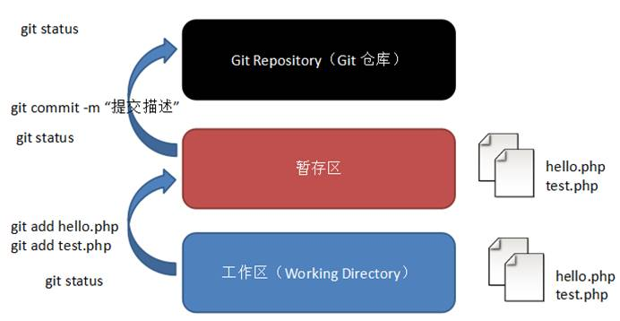

## 本地git工作区域



## 利用git clone将本地仓库与远程仓库连接

```c++
-   首先在github上new一个repository
-   在本地某个地方打开git bash(命令行模式)
-   输入：git clone 地址，其中地址是repository的url
-   修改/增添文件
-   git add . //把所有的文件放入缓存区中
-   git commit -m "xxx"  //最后确认，将文件放入本地仓库(git仓库)，并附上说明文字xxx
-   git push //将git仓库所更变的文件push到远程仓库中
```

## 直接将本地仓库与远程仓库连接

```c++
找到本地文件夹，git bash here
git init //初始化仓库
git add .(文件name) //添加文件到本地仓库
git commit -m “first commit” //添加文件描述信息
git remote add github/gitee + 远程仓库地址 //链接远程仓库，创建主分支，最好用SSH，不用输入密码
git pull github/gitee main //相当于两次操作，git fetch + git merge gitee/main，原因是：远程仓库有可能发生了改变，比如说：其他人push一个new                                //commit进远程仓库，这时候需要利用git fetch来同步远程仓库，并将远程仓库分支合并到本地的main之中，第一次可能需要这个操作，                            //之后就不需要了
git push -u github/gitee main //把本地仓库的文件推送到远程仓库，第一次需要加-u，之后就不需要加-u了
```

## 添加/删除文件到git repository

```c++
git add a.txt //将a.txt添加到缓存区中
git status //此时会显示git当前的状态，有一个新文件待确认添加
git commit -m"first add" //将a.txt添加到本地仓库之中（.git文件夹里面）
git rm a.txt //将a.txt从本地仓库中删除
git status //此时会显示git当前的状态，有一个新文件待确认删除
git commit -m"first delete" //确认删除
//如果是删错了，可以利用如下语句丢弃工作区修改，把误删除文件恢复到最新版本
git reset //误删使用
git checkout a.txt //误删使用
```


## git配置信息：

```c++
git remote add origin 地址 //本地与远程仓库建立连接
git config --global [user.name](http://user.name) 'xxx'
git config --global user.email 'xxx'
```

## git分支操作

### 创建分支

```c++
git branch dev //创建dev分支
git checkout dev //切换到dev分支
git branch //查看当前分支情况
```

### 合并分支

```c++
git merge dev //将dev分支合并到main之中
```

### 删除分支

```c++
git branch -d dev //删除分支，需要在合并后删除
```

## 关联gitee与github

-   通过创建不同的远程仓库名，来关联本地仓库到不同的远程仓库中

```c++
git remote add github SSH //将本地仓库关联一个名为github远程仓库
git remote add gitee SSH //将本地仓库关联一个名为gitee远程仓库
git remote -v //查询当前已关联的远程仓库的信息
```

-   那么以后利用指令`git push gitee/github main`就可以选择push main分支到哪个远程仓库了

