## git资料

git官网的doc：https://git-scm.com/

## 本地git工作区域


## 利用git clone将本地仓库与远程仓库连接

```c++
-   在本地某个地方打开git bash(命令行模式)
-   输入：git clone 地址，其中地址是repository的url
-   修改/增添文件
-   git add . //把所有的文件放入缓存区中
-   git commit -m "xxx"  //最后确认，将文件放入本地仓库(git仓库)，并附上说明文字xxx
-   git push //将git仓库所更变的文件push到远程仓库中
```

## 直接将本地仓库与远程仓库连接

```c++
找到本地文件夹，git bash here
git init //初始化仓库
git remote add github/gitee + 远程仓库地址 //链接远程仓库，创建主分支，最好用SSH，不用输入密码
git pull github/gitee main //相当于两次操作，git fetch + git merge gitee/main，原因是：远程仓库有可能发生了改变，比如说：其他人push一个new commit进远程仓库，这时候需要利用git fetch来同步远程仓库，并将远程仓库分支main合并到本地的当前分支之中（说白了就是把远程仓库）改变的东西同步到本地仓库，远程仓库创建了一个文件你本地仓库也会同步过来相同的文件，这是多人操作的基础
//这句话的意思：把远程仓库名为github/gitee的分支main来取出来，与本地当前分支（首先要调整到main）合并
git push -u github/gitee main //将分支main推送到远程仓库github/gitee中，如果想推送当前分支，那么直接省略main即可
```

## 查看working directory/stage/repository不同

```shell
git diff #查看working directory与暂存区stage的不同
git diff HEAD #查看wd与HEAD的commit有什么不同
git diff -cached HEAD #查看stage与HEAD的commit有什么不同
git diff commit1 commit2 #查看两次提交的不同
```


## 撤销修改

```c++
git reset HEAD -- a.txt//拉取最近一次提交到版本库的文件a.txt到暂存区，该操作不影响工作区（当不加-- a.txt时，表示所有文件）
git checkout a.txt//拉取暂存区文件a.txt，并覆盖掉工作区相应的文件
```

## 添加/删除文件到git repository（版本库）

```c++
git add a.txt //将a.txt添加到缓存区中
git status //此时会显示git当前的状态，有一个新文件待确认添加
git commit -m"first add" //将a.txt添加到本地仓库之中（.git文件夹里面）
git rm a.txt //将a.txt从本地仓库中删除，包括工作区文件
git status //此时会显示git当前的状态，有一个新文件待确认删除
git commit -m"first delete" //确认删除
//如果是删错了，可以利用如下2语句丢弃工作区修改，把误删除文件恢复到最新版本
git reset HEAD -- a.txt
git checkout a.txt
```

## 恢复之前版本的commit

```c++
git log //查看commit的信息，最近commit会在最上面
git reset commit //在git log上可以看到每个commit的校验和，将该校验和复制，并替换commit-num，这句话将该版本提交到暂存区中
git checkout a.txt //拉取暂存区的a.txt文件到工作区，并覆盖工作区
```

## git配置信息

```c++
git remote add origin 地址 //本地与远程仓库建立连接
git config --global [user.name](http://user.name) 'xxx'
git config --global user.email 'xxx'
```

## git分支操作

### 创建分支

```c++
git branch dev //创建dev分支
git checkout dev //切换到dev分支，此时HEAD指针指向切换到的dev分支
git branch //查看当前分支情况
```

### 合并分支

```c++
git merge dev //将dev分支合并到main之中（首先需要切换到main）
```

### 合并冲突操作

-   假设我现在有两个分支，一个分支是main，一个是dev，main与dev中均有merge.cpp文件，未合并前，如下：

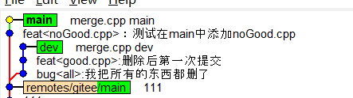

​	内容如下：

```c++
//main中的merge.cpp

#include <iostream>
using namespace std;
int main(){
	cout << "这是在main分支所输出的内容！" << endl;
}


//dev中的merge.cpp

#include <iostream>
using namespace std;
int main(){
	cout << "这是在dev分支所输出的内容！" << endl;
}
```

-   现在我checkout到main分支上，准备merge dev，显示我有conflict

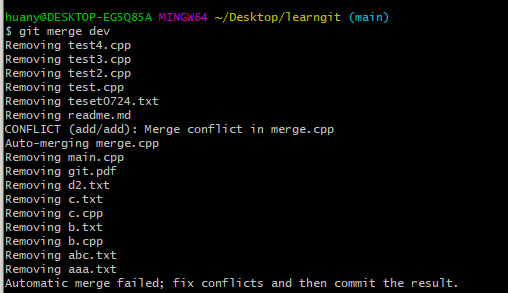

-   git status一下，看一看哪个没有被merge

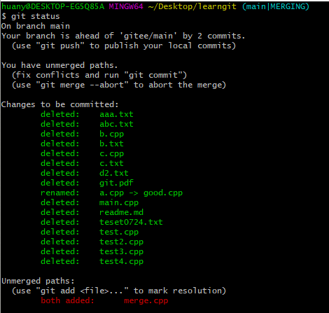

-   vi merge.cpp查看冲突文件

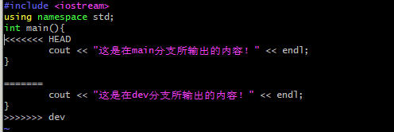

-   删除分歧后：

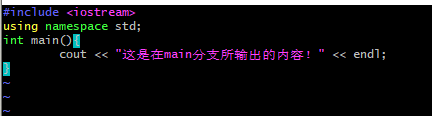

-   git add merge.cpp 
-   git commit ，会弹出一个界面，需要再次确定是否merge，以及merge的commit message，输入message之后，wq一下就行了

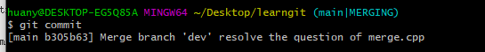

-   再次调用gitk --all，会发现两个分支已经被merge了

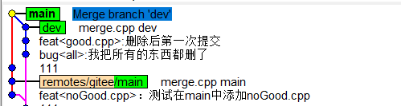

### 删除分支

```c++
//删除本地分支
git branch -D dev //删除未合并分支
git branch -d dev //删除已合并分支
//删除远程分支
git push gitee -d main //删除远程仓库gitee中的main分支
```

## 关联gitee与github

-   通过创建不同的远程仓库名，来关联本地仓库到不同的远程仓库中

```c++
git remote add github SSH //将本地仓库关联一个名为github远程仓库
git remote add gitee SSH //将本地仓库关联一个名为gitee远程仓库
git remote -v //查询当前已关联的远程仓库的信息
```

-   那么以后利用指令`git push gitee/github main`就可以选择push main分支到哪个远程仓库了

### 如何可视化查看分支情况？

-   利用gitk工具

    ```shell
    gitk --all#可视化所有commit以及分支
    gitk --simplify-by-decoration --all
    ```


## 标签操作

-   发布新版本时，我们需要在当前版本库打上标签（tag），这样就唯一就唯一确定了打标签时刻的版本。将来无论什么时候，取某个标签的版本，就是把那个打标签的时刻的历史版本取出来  

```c++
git tag v1.0 //打上v1.0标签
git tag //查看标签
git tag -d v1.0 //删除标签
git tag -a v1.0 -m"version 1.0 released" //创建带有说明的标签，-a指定标签名， -m指定文字
git push gitee v1.0 //推送某个标签到远程仓库
git push gitee tags //一次性推送所有尚未推送的标签到远程仓库
//如果删除远程仓库标签，需要两步：
git tag -d v1.0 //删除本地标签
git push gitee :refs/tags/v1.0 //删除远程仓库标签
```

## vim基本操作

```c++
1. vim b.txt //利用vim打开b.txt
2. 按i进入编辑模式，这时候能在文件中写内容
3. 按Esc回到锁定模式
4. 锁定模式按下:进入命令模式
5. 命令模式下，quit不保存退出 write保存不退出 wq保存退出
```

## .gitignore

- 作用：忽略日志文件、临时文件、编译的中间文件等，不将这些文件提交到git上

  ```shell
  #忽略CMake生成的日至文件、临时文件
  CMakeCache.txt
  CMakeFiles
  Makefile
  cmake_install.cmake
  install_manifest.txt
  
  #
  # Sublime Test
  #
  # cache files for sublime text
  *.tmlanguage.cache
  *.tmPreferences.cache
  *.stTheme.cache
  
  # workspace files are user-specific
  *.sublime-workspace
  
  # project files should be checked into the repository, unless a significant
  # proportion of contributors will probably not be using SublimeText
  # *.sublime-project
  
  #
  # C / C++
  #
  
  # Compiled Object files
  *.slo
  *.lo
  *.o
  *.obj
  *.ko
  *.elf
  
  # Precompiled Headers
  *.gch
  *.pch
  
  # Compiled Dynamic libraries
  *.so
  *.dylib
  *.dll
  *.so.*
  *.dylib
  
  # Fortran module files
  *.mod
  
  # Compiled Static libraries
  *.lai
  *.la
  *.a
  *.lib
  *.lo
  
  # Executables
  *.exe
  *.out
  *.app
  
  /**/build
  /**/build.*
  
  .tags
  .vscode
  ```

  

## 常见问题

### git中如果我不故意手抖将working directory中一个重要的文件rm -rf了怎么办？

- 如果仅仅是删除了，没有git add，那么直接git checkout file_name即可，如下图所示：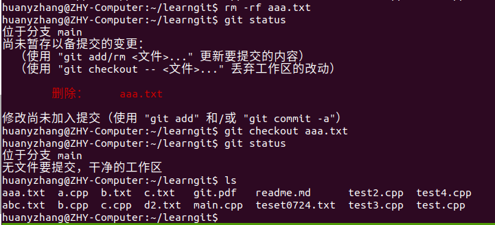

  - 首先我rm -rf aaa.txt，利用git status查看，发现aaa.txt已经被删除，但是没有被加入到index中，颜色是红色
  - 接下来我用git checkout aaa.txt，将文件aaa.txt还原成上次提交后的样子，再次git status，发现没有提交，并且aaa.txt已经回来了
- 如果是git add aaa.txt之后，那么需要首先将git reset aaa.txt，此时暂存区的aaa.txt已经恢复成了没有被add时的状态，再次git checkout aaa.txt，即可恢复到文件在working directory被修改过后，没有被提交到stage的状态，即“Changes not staged for commit”的红色状态

> 注意：如果恢复修改过文件也是一样，那么git checkout会利用最新提交的文件全部替换已经修改过的文件，这意味着你修改过的文件不再存在。警惕！

- 如果已经提交到repository，即git commit -m"xxx"，那么如果你真的确定你想完全回退到你上一次commit的结果，用git reset --hard HEAD~即可;或者你可以用git reset HEAD~ + git checkout aaa.txt组合也是可以达成的


### 请问git reset --soft/[mixed]/hard HEAD～到底有什么区别？

- git reset --soft HEAD～ 仅仅移动HEAD分支指向，指向为它的父节点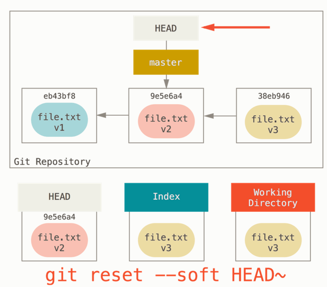
- git reset [--mixed] HEAD~ 移动HEAD分支指向，并同时改变index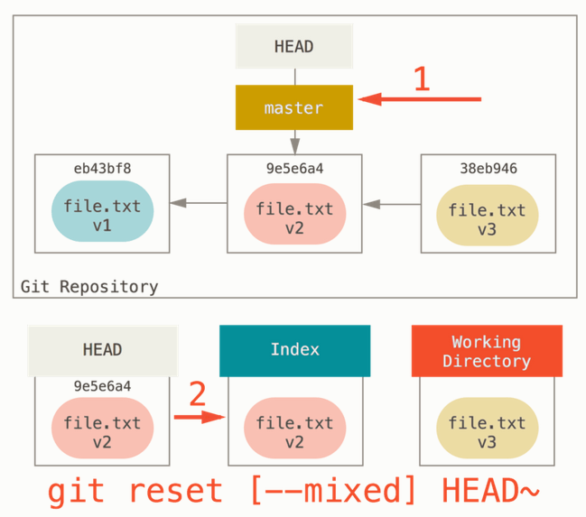
- git reset --hard HEAD～ 慎！将整个工作目录重置为上一次提交时的状态图如下所示：

### git本地有2个commit合成一个怎么操作？

- git log #查看需要合并的前n个commit的commit number
- git rebase -i commit_number1 commit_number2 ...  #进入合并选择窗口

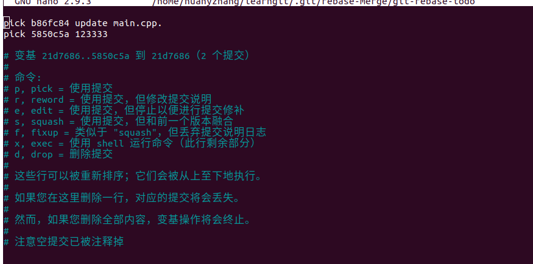

- 按照指示，利用s与前一个版本进行融合

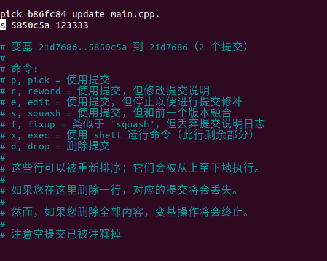

- 保存退出，之后键入以下命令，第二次进入合并窗口

  ```shell
  git add .
  git rebase --continue
  ```

- 再次确认合并，然后就可以打开git log，发现多个commit已经被合并了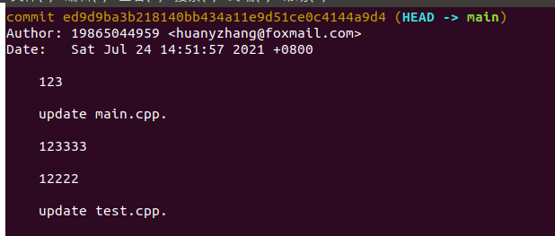

### 无法git pull怎么办？即当远程库更新，但是你的本地库也修改了相应的文件

1.  如果你无视本地修改的相应文件

    ```shell
    git reset -- hard #退回到当前版本的HEAD，并且以hard形式，即将git repository、缓冲区、working directory全部擦除换上当前版本HEAD
    
    git pull #再次拉取
    ```

2.  如果你想看一看到底是留哪一个，那么可以直接：

    ```shell
    git stash #将working directory保存到stack中，并退回到当前版本的HEAD
    git pull #顺利pull下来
    git stash pop #打开冲突文件，会显示冲突信息，包括git pull下来什么，git stash下来什么，再次修改，保存
    git pull gitee main #这次就不会有冲突啦，git默认你已经手动修改好了
    ```

### git commit message你是怎样填写的？

```shell
<type>(<scope>): <subject>
#type描述了你本次commit是什么类型，比如新增了功能(feat)、fix bug、文档说明docs、test、merge等
#scope可选项，说明你本次commit的范围是什么
#subject必选项，对于你这次commit的小于50字的一些描述
```


### 其他

- https://segmentfault.com/a/1190000019315509
