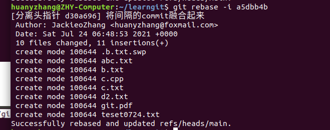
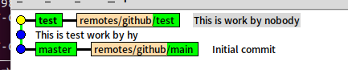
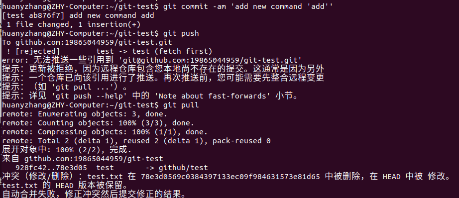
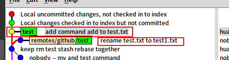

# 第一章：git基础

## 查看手册

man git-checkout/ git-log / git-branch ...


## 配置git

显示所有config信息：


==注意：如果同时存在git local与git global的email和name，那么默认是用git local的信息（name + email）做提交！！！==

这将会是后面模拟多人协作的基础，即之后会出现nobody这个local来模拟其他人


## 给文件进行重命名的方法


可不可以用1条指令替换3条指令呢？

**git mv** 


## git log查看版本演变历史


git checkout -b temp SHA1  #在SHA1号的那个commit处新建一个temp分支


在有2个分支以上的情况下，git log查看的是当前分支


还可以指定查看的分支


git log --all #查看所有分支信息，包括远程分支


  git log --graph --all #以图形化方式来查看git log


显示4行，每个commit以1行的方式显示


## gitk图形界面来查看版本历史

gitk --all #查看所有分支

## .git目录


HEAD里面的内容是头指针所指的分支


config里面显示的是配置信息


refs存放的是各个分支与tag的信息

refs/heads里面存储着的是所有的分支的头结点指针


object：

重要！


## commit、tree、blob三个对象之间的关系


个人认为：一个commit对应了一个tree，里面存放着commit那一瞬间的snapshot，然后这颗tree的叶子节点都是blob，对应着文件，而blob是否相同是通过blob里面内容是否相同来识别的，而不是通过名字（其实没有blob名），好处是大大节约了存储空间


## 分离头指针

含义：detached head，即我们正工作在一个没有分支的commit上

危险：在分离头指针后，由于工作在一个没有分支的状态下，即commit没有绑定分支，因此任意commit都会被丢弃，但我们也可以利用这一点，对代码做一些非常大胆的试验，最后checkout回去后，不用理会变更了什么


## HEAD与branch

 

-a选项查看本地与远程仓库


总结：HEAD不一定会指向分支头，比如说你用分离头指针操作；但是当你在checkout时，HEAD也会发生改变，指向分支头commit


可以用HEAD HEAD~ HEAD~n来表示当前分支头，父亲，爷爷


解决两个分支没有公共祖先，即non-fast-forward的情况下的冲突：

- rebase
  - 好处就是保证master主分支是线性的，这样让主分支更加清晰


- merge
  - 好处是完全不改变原来的两个分支，只是增加一个commit，将两个分支融合进来


# 第二章：独自使用git时常见的场景

## 删除不需要的分支


git branch -d 分支名 #删除已经合并了的分支

git branch -D 分支名 #删除未合并的分支

## 修改最近的commit message

些概念始终是git commit --amend


## 修改以前的commit message

git rebase #变基


要将good commit 变成good commit ！


拷贝good commit所在commit的父哈系数


git rebase -i a90f85146e9468bab3a9589e59d


由于我们需要change commit message，因此选择r

> 注：pick的意思是保留原来的commit的一切东西，包括commit tree blob


之后会又弹出一个交互界面，里面将good commit修改，加上！然后用git log查看，就能看到message已经多了！


可以发现，分离头指针之后，在变基后面的commit都是新的commit，所有的哈希号都不同，但是内容不变，即blob不变


 

## 将多个commit整合成1个

将前4个commit整合到1个commit之中，那么base就应该是b.cpp了


选中1个作为融合的主体commit，其他选择squash作为被融合的commit


这时候又会跳出一个页面，输入融合后的commit，如下：


成功整合4个commit到1个commit中去


## 怎样把间隔的几个commit整理成一个


将以下2个commit合并起来，挑选432为基


调整被融合的commit的位置，使得其在待融合的commit的下面，并修改成squash


保存退出，来到第二个页面，添加commit message即可




## 比较暂存区和HEAD所含文件的差异

git diff --cached 


修改一个文件之后，git add将修改过的结果添加到暂存区，得到如下：


如果此时你觉得暂存区里面的东西暂存错了，需要变成其他的，那么还可以在工作区修改，重新git add


## 比较工作区和暂存区所含文件的差异

直接git diff


## 恢复暂存区成HEAD一样

git reset (--mixed) HEAD


## 恢复工作区成暂存区一样

git checkout 文件名


我变更了abc.txt文件，并添加到了暂存区（绿色），这样做的意思是我的这份数据已经安全了。之后，我可以再修改abc.txt，尝试添加一些独特的东西（红色）


可以通过git diff来看到添加了一段文字


这时候我突然不想要这段文字了，那么直接用git checkout 文件名，即可让工作区恢复成暂存区一样，运行git diff，说明暂存区与工作区一个样


## 怎样取消暂存区部分文件的更改？

git reset HEAD 是将暂存区所有的更改恢复到与HEAD一样的状态，而用git reset HEAD可以达成恢复暂存区部分文件

git reset HEAD 文件名


## 消除几次提交

git reset --hard SHA1，将暂存区与工作区恢复到SHA1对应的commit，并丢弃该commit前面的孩子commit

 

## 看看不同提交的指定文件的差异

git diff commit1 commit2 <文件名>


## 删除文件

将工作区与暂存区的d2.txt文件删除


只将工作区的d2.txt文件删除


## 开发中临时加塞了紧急任务怎么处理

想象一下这样的场景：你正在开发一个功能，暂存区里面存放着已经搞好的任务：删除d2.txt文件；工作区还有abc.txt文件在修改，并没有被添加到暂存区中，现在测试部门紧急任务：让你取修复测试中产生的一个bug，你应该如何处理当前的工作区与暂存区呢？

用git stash


此时，工作区、暂存区、HEAD的内容完全一致了


解决紧急任务：删除.b.txt.swp文件，并提交


恢复原来已完成的工作区和暂存区的工作：


注：如果用git stash apply，那么堆栈的内容不会被pop出来，但是git stash pop，是弹出堆栈内容，并且恢复工作与暂存区

## 如何指定不需要git管理的文件

.gitignore文件是用来配置git忽略的文件，包括中间文件等

注意以下几点即可：

- .gitignore必须要起这个名，否则无效
- .gitignore文件中，docs/的意思是忽略docs文件夹下面的所有文件；而docs的意思是忽略名为docs的文件、以及docs文件夹下面的所有文件


## git的备份


# 第四章：git多人单分支集成协作时常见场景

## 将本地仓库同步到GitHub上

1. 首先在本地创建ssh密钥，并且将该密钥填入github上
2. git init 创建一个git仓库
3. git remote add 远端仓库名 SSH地址
4. git pull 远程仓库名 分支


利用gitk来查看，看到远端分支被fetch以及merge到了本地分支master中。


## 不同人修改了不同文件如何处理？

首先，git clone SSH git-test-02，并且修改git-test-02的用户名为nobody，email为1123380424@qq.com


原来git-test只有一个main分支，在main分支上创建一个test分支，如下所示：


在用户1上fetch一下


在本地创建一个新分支，该分支绑定remote上面的test


在本地test的分支下，添加开发任务，创建了test.txt文档，并add commit push 到远端


> 注意：为什么可以直接用git push，因为test分支仅仅绑定了remotes/git-test/test分支
>
> 

看一下用户1当前的branch信息，发现本地test与远程test已经同步了


用户2 git fetch github一下，然后得到新的分支


其他操作与上述相同，本地test与远端test绑定，并且通过修改本地test，最后push到远端进而修改远端test




这时用户1突然想修改README.md来说明test.cpp，它没有git fetch git merge，而是直接修改了README.md，试图push到远端，毫无例外，被拒绝


git fetch github一下，看一看


领先1，落后1，说明在你的本地test branch领先于github上的test1个commit，并且在你修改test的时候，已经有人commit了一个新的commit到远端test

此时，用git merge github/test命令，merge两个分支


此时在看一看test节点，已经生成了一个新的commit

、


这时，我们看到remotes/github/test还落后于本地test，因此直接git push即可


==**这说明，如果不同人修改了不同的文件，那么用git merge指令确实可以解决问题，git会智能的更新到两个文件都是最新的状态，并新增一个commit**==


## 不同人修改了同文件的同一区域如何处理？

首先对用户2 git pull一下，意思是先fetch远端分支，并且将远端分与本地分支合并


用户2 修改test.txt文件，增加两行信息，经过add commit push后，如下


用户1也同事修改了test.txt文件，增加了两行信息，如下：


注意可以用git commit -am 'xxx' 来跳过git add环节，直接commit


git push，肯定报错


那么尝试用git pull，试试看能不能合并，当然是失败的，因为修改了同一个文件


用status来看，发现出现双方修改提示，并且打开test，会出现我们修改过的stash、rebase与用户2修改过的mv test


修改过后，如下所示


gitk


git push


## 同时变更了文件名和文件内容如何处理？

用户2把test.txt变成了test1.txt


用户1并不知晓，并且依然在test.txt文本中加入了新内容，并且push，当然是失败的，然后git pull一下，看一看，发现test.txt被删除，而在本地分支，test.txt被修改，增加了add command







此时需要手动修正冲突，那么我需要reset到未add命令之时


此时红色的相当于我修改了test.txt文件，但是没有add，也没有commit


git stash一下，将工作区的内容保存起来


c90ff77d6eb

终于可以合并了


## 把同一文件改成了不同文件名如何处理？

git会将两个文件同时保留


# 第五章 Git集成使用禁忌

## 禁止向集成分支执行push -f操作

## 禁止向集成分支执行变更历史(rebase)的操纵


# 第六章 初始github

## github为什么会火


## github核心功能

## 怎样快速淘到自己感兴趣的项目

关键字 in:readme 

在readme中搜索关键字

```
git 学习资料 in:readme 
```


还可以加上star限制条件，即

```
git 学习资料 in:readme stars:>20000
```


# 第八章 Gitlab实践

## 为什么要用gitlab？

CI: CI(Continuous integration，中文意思是持续集成)是一种软件开发时间。持续集成强调开发人员提交了新代码之后，立刻进行构建、（单元）测试。根据测试结果，我们可以确定新代码和原有代码能否正确地集成在一起。

CD(Continuous Deployment， 中文意思持续部署)是在持续集成的基础上，将集成后的代码部署到更贴近真实运行环境(类生产环境)中。比如，我们完成单元测试后，可以把代码部署到连接数据库的Staging环境中更多的测试。


常见CI工具：

- gitlab
- jenkins
- travis


## gitlab强大之处


**DevOps**（**Dev**elopment和**Op**erations的组合词）是一种重视“软件开发人员（Dev）”和“IT运维技术人员（Ops）”之间沟通合作的文化、运动或惯例。透过自动化“软件交付”和“架构变更”的流程，来使得构建、测试、发布软件能够更加地快捷、频繁和可靠。[[1\]](https://zh.wikipedia.org/wiki/DevOps#cite_note-1)[[2\]](https://zh.wikipedia.org/wiki/DevOps#cite_note-2)[[3\]](https://zh.wikipedia.org/wiki/DevOps#cite_note-3)[[4\]](https://zh.wikipedia.org/wiki/DevOps#cite_note-4)


开发与运维有什么区别？

开发工程师：侧重编程。必须熟练掌握一项编程语言，以及脚本语言，需要熟练掌握数据结构、算法，有丰富的开发经验。

运维工程师：对底层知识掌握必须丰富，对常见问题有经验总结，但是对编程要求不高。

