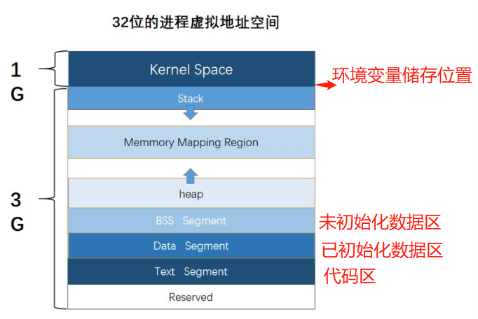
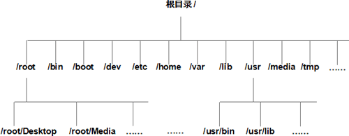
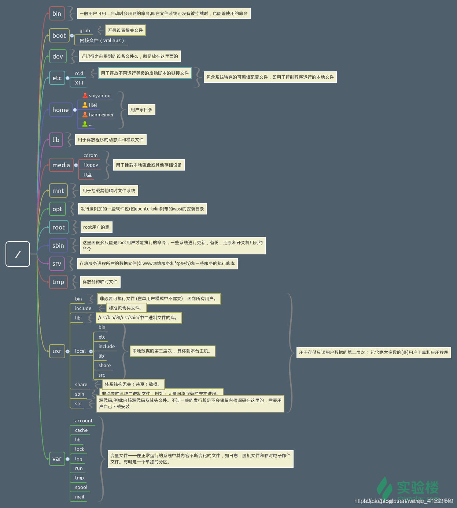

## Linux内存空间布局



## 实时操作系统与分时操作系统区别？

-   实时操作系统：指的是外部事件发生时，有足够快的速度去处理与相应

-   分时操作系统：把CPU运行分成若干时间片分别处理不同的请求的系统

## 举例实时与分时操作系统

-   实时操作系统：

    -   一些嵌入式芯片跑的系统都是实时操作系统，比如FREERTOS等

    -   应用领域：用于对时间处理敏感的场合，比如说各种嵌入式芯片

-   分时操作系统：

    -   linux与常见windows都是分时操作系统

    -   应用领域：流行的PC与服务器都是分时操作系统

## 什么是linux？

-   linux是免费试用和自由传播的类Unix操作系统，是一个基于POSIX和UNIX的多用户、多任务、支持多线程和多CPU的操作系统。它继承了UNIX以网络为核心的设计思想。

## linux包括几个部分？

-   内核
-   shell：是系统的用户界面，提供了用户与内核进行交互操作的一种接口，它接收用户命令并把它送去内核执行
-   文件系统
-   应用程序
-   网络接口
-   设备驱动

## linux文件系统层次结构





## linux常用命令

-   系统信息
    -   arch 显示处理器架构（x86 还是x86_64）
    -   uname -r 显示内核版本
    -   cat /proc/interrupts 显示中断
-   关机

    -   init 0

    -   shutdown -h now

    -   telinit 0
-   文件和磁盘空间：
    -   df -h 列出linux中所有的磁盘，并以人可读的方式呈现磁盘大小
    -   fdisk - l列出所有分区表
-   文件目录与管理：

    -   cd 切换目录

        -   cd /切换到根目录

        -   cd  ~切换到个人主目录
-   pwd 查看当前绝对路径
    -   mkdir 创建目录

        -   mkdir test //在当前目录创建一个test文件夹

        -   mkdir -p test2/test3 //在当前目录下的test2目录中，创建test3目录，如果没有-p，那么会报错
-   rmdir 删除目录
    
    -   rmdir  test2/test3 //在当前目录下的test2目录中，删除test3目录，注意test3目录一定是空才能删除
    
    -   rm -rf test2 //强行递归删除目录test2以及其下的所有内容，不可恢复
    -   ls 查看当前目录下的文件
    -   ll查看文件详细属性
        -   ls -a 查看隐藏文件
-   cp 拷贝文件
        -   cp source  dest //比如，cp ./main.cpp test2 -----将本目录下的main.cpp文件复制到当前目录下test2目录中
-   mv 移动文件(与cp相同)， 可以利用它来重命名文件，mv a.txt b.txt //将a.txt文件重命名为b.txt文件
-   创建与删除文件

    -   touch xxx.md/xxx.cpp/xxx.c

    -   rm xxx.md/xxx.cpp/xxx.c
-   查看文件内容：

    -   cat（用于连接文件并打印到标准输出设备上，即终端上）

        -   cat -n main.cpp //将main.cpp文件编号打印

        -   cat -n main.cpp > main2.cpp //将main.cpp文件的内容加上行号后输入到main2.cpp文件中

        -   cat -n main.cpp main2.cpp > main3.cpp //将main.cpp与main2.cpp文件加上行号，一起输入到main3.cpp文件中

        -   cat /dev/null > main3.cpp //清空main3.cpp文件

    -   tac
        -   tac main.cpp 将main.cpp文件反向输出

    -   more 与cat相似，但是更方便逐页阅读

    -   less 与more相似，但是需要按q来退出

    -   head

        -   head -n a main.cpp 显示main.cpp的前a行

        -   head -c 20 main.cpp 显示main.cpp的前20个字节

    -   tail（与head用法相似）
-   文件目录与权限：

    -   chmod

        -   chmod 谁 +- rwx 文件名，其中，谁包括：

            -   u:user 文件所有者

            -   g:group 文件所有者所在组

            -   o: other 所有其他用户

        -   chmod ugo+rwx main.cpp 所有人都可以对main.cpp rwx

    -   chown

    -   chgrp

    -   umask
-   文件查找：

    -   which
-   whereis
        -   比如一个binary被添加到了PATH中，那么可用：whereis DCPSInfoRepo来查看它的绝对路径
-   locate
    -   find
    -   find 路径 -name "*.cpp" //查找路径及其子目录下所有后缀名为.cpp的文件
-   进程管理：

    -   ps -u 显示所有用户进程

    -   ps -af 显示所有跟终端相关的进程详细信息

    -   ps -ax 列出所有进程的信息

    -   top 实时显示进程状况、CPU占用率、内存占用率、PID
-   前台运行程序：

    -   ctrl + c 结束一个前台正在运行的程序

    -   ctrl + z 停止一个前台正在运行的程序
-   删除：

    -   rm -rf 无提示递归删除本目录下的所有文件及其子文件

## linux编辑、编译与链接

-   首先创建一个.c文件，touch hello.c

-   编辑器：利用gedit编辑器打开 hello.c文件：gedit hello.c /  vi hello.c

-   编写完程序后，保存，利用gcc编译器来编译与链接.c文件，生成可执行文件gcc hello.c -o hello

## 利用g++编辑第一个c++程序

-   保存twoSum.cpp文件
-   保存twoSum.h文件
-   保存main2.cpp文件
-   利用g++ main2.cpp twoSum.cpp -o twoSum.exe来预编译、编译、汇编、链接twoSum.cpp与main2.cpp与静态库，最终生成可执行文件twoSum.exe

## STDIN_FILENO & STDOUT_FILENO

-   STDIN_FILENO：接收键盘的输入
-   STDOUT_FILENO：向屏幕输出

```c++
#include <stdio.h>
#include <string.h>
#include <unistd.h>
 
int main(int argc, char *args[])
{
	// 定义读取文件的缓冲区
	char buf_read[1024];
	// 定义写入文件的缓冲区
	char buf_write[1024];
	
	// 循环读取用户从键盘输入的信息
	while (1)
	{
		// 清空读取文件缓冲区中的内存
		memset(buf_read, 0, sizeof(buf_read));
		// 清空写入文件缓冲区中的内存
		memset(buf_write, 0, sizeof(buf_write));
		
		// 打印提示信息
		char input_message[100] = "input some words : ";
		write(STDOUT_FILENO, input_message, sizeof(input_message));
		// 读取用户的键盘输入信息
		read(STDIN_FILENO, buf_read, sizeof(buf_read));
		// 判断用户输入的内容是否为quit
		if (strncmp(buf_read, "quit", 4) == 0)
		{
			// 如果用户输入的是quit，程序退出循环
			break;
		}
		// 如果用户输入的不是quit
		// 把内容拷贝到写入文件缓冲区中
		strcpy(buf_write, buf_read);
		// 打印提示信息
		char output_message[100] = "output some words : ";
		write(STDOUT_FILENO, output_message, sizeof(output_message));
		// 将信息显示在屏幕上
		write(STDOUT_FILENO, buf_write, strlen(buf_write));
	}
	
	return 0;
}
/*
输出：
input some words : 123
output some words : 123
input some words : 234
output some words : 234
input some words : quit
*/
```

