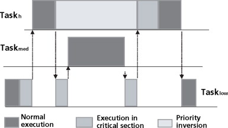

## 什么是进程？线程？协程？

-   进程是程序的运行过程，是系统进行资源分配的基本单位
    -   到底分配了哪些资源呢？**CPU、内存、磁盘空间、I/O设备、网络流量**
-   可以把线程理解为“轻量级进程”，线程是CPU调度的基本单元

-   协程就是用户级线程。是比内核级线程更轻量级的的存在，协程不受操作系统内核所管理，而完全是由程序所控制，因此，没有线程切换的开销，和多线程比，线程数量越多，协程的性能优势就越明显
    -   协程的实现：C语言中：setjmp与longjmp来实现：https://www.cnblogs.com/heluan/p/9689751.html

## 进程与线程的区别

-   地址空间：同一进程下的线程共享内存地址空间，而进程间是独立的地址空间。注意：线程也是有独立的PCB！
-   资源共享：同一进程内的线程共享本进程的资源如内存、I/O、cpu等，但是进程之间的资源是独立的。（进程之间也有共享的东西，否则没有办法通信了，比如说：文件描述符（因此可以用文件进行通信）、mmap映射区（可以用共享内存通信））
-   强壮性：多进程比多线程要强壮
    -   为什么？答：

        -   因为同一进程之下的线程共享着进程的地址空间，当某个线程指针指向错误的地址时，可能会影响进程下的所有线程。

        -   虽然说线程与线程之间有自己独立的栈空间，但是一个进程内仍然可以发生线程1访问线程2的栈空间这种事情，因此有可能发生一个线程把另一个线程的栈空间写坏。
-   切换：进程间切换，消耗资源大，同一进程下的线程间的切换，消耗资源小

## 相比于进程，线程的优点与缺点？

-   优点
    -   提高了程序并发度
    -   线程间切换开销小
    -   由于共享代码段、数据段、堆区，因此数据通信、共享方便
-   缺点
    -   没有进程强壮

## 线程有没有自己的资源？

-   线程共享资源：（0-3G地址空间里面除了栈空间外几乎都共享）
    -   地址空间(.text（代码段）/.data（数据段，里面有全局变量、）/.bss/heap/共享库)
    -   进程控制块PCB
    -   用户ID与组ID
    -   当前工作目录
    -   每种信号的处理方式
-   线程独享资源：

    -   栈空间（内核栈与用户栈，其中用户栈默认为1M）
    -   程序计数器：用于记录下一条指令在内存的位置、寄存器
    -   线程ID
    -   调度优先级（改变同一进程下多个线程的实现优先级）
    -   errno变量（唯一的全局变量不共享，一般用在系统调用返回 ）
    -   信号屏蔽字（mask，利用信号屏蔽字可以实现同一进程下的不同线程接收不同的信号）

## 什么是用户级线程？什么是内核级线程？

-   用户级线程：也叫作协程， 是一种更轻量级的线程。线程的工作都由程序来负责，包括线程切换。线程切换在用户态即可完成，因此没有线程切换开销。

-   内核级线程：线程的工作都由操作系统内核完成，包括**线程的调度**（在linux下，内核级线程与进程是一个样的，一个程序里面越多线程，理论上来将能够抢到cpu的概率越大）、切换等，因此必须在核心态才能完成调度与切换

## 多线程有哪些模型？

-   多对一：多个用户态线程映射到一个内核级线程 

    -   优点：用户级线程的切换在用户态就可实现，系统开销小，效率高

    -   缺点：当一个线程被阻塞后，整个进程也会被阻塞，并发度不高

-   一对一：一个用户态线程映射到一个内核级线程

    -   优点：并发能力强

    -   缺点：成本高、资源消耗高

-   多对多：同时拥有多对一与一对一的优点

## 进程间通信方式有哪些？

-   信号量

-   套接字socket

-   信号 signal

-   **管道 pipe**

-   **消息队列**

-   **共享内存**

## 线程间通信方式有哪些？

-   不同进程间线程的通信，相当于进程之间的通信。

-   同一进程间不同线程的通信：

    -   信号量（freeRTOS就是单进程多线程os）
    -   信号
    -   **全局变量**
    -   **消息队列**

### 线程间的同步有哪些方式？

-   互斥锁
-   条件锁

## 什么是死锁？

-   各个进程在保持自己手里的资源的同时，等待其他进程释放资源，导致各个进程都发生阻塞，使得进程无法推进向前的一种状态。

## 死锁产生的条件？

-   互斥访问
    -   某种资源一次只允许一个进程访问，直到该进程访问结束，其他进程无法访问该资源

-   不剥夺
    -   进程获取的资源不能通过操作系统剥夺，而只能等待进程主动释放该资源

-   占有且等待
    -   进程本身它就有占有资源，同时还在等待其他进程释放资源

-   循环等待
    -   存在一个进程链，使得每个进程都有下一个进程所需要的至少一种资源

## 发生死锁怎么办？

-   资源剥夺
    -   挂起某些死锁程序（也就是将进程放到了磁盘上），并抢占它的资源，将这些资源分配到其他的死锁进程

-   撤销进程
    -   强制撤销部分、甚至全部死锁进程，并剥夺这些进程所占有的资源

-   进程回退
    -   让一个或多个死锁进程回退到足可以避免死锁的地步。（需要堆来记录进程的每一步变化，系统开销极大 ）

## 死锁与饥饿、死循环的区别？

-   死锁是多个进程之间，饥饿可以是一个进程。

-   死循环也可以上CPU跑

-   死锁与饥饿是操作系统需要解决的问题，而死循环是程序员应该解决的问题

## 说一下如何从逻辑地址到物理地址的转换？

-   当进程在内存中连续存放时，用的是基地址 + 偏移地址（逻辑地址）计算出物理地址，其中基地址记录在基址寄存器中

-   如果一个系统采用分页存储管理： 

    -   算出页号（逻辑地址 / 页面大小）

    -   页内偏移量（逻辑地址 % 页面大小）

    -   通过查询页表（是一个记录页号与块号映射关系的一张表），得到页号对应的内存块号，那么最终

    -   物理地址 = 内存块号 * 内存块大小 + 页内偏移量

## 什么是动态重定位？

-   在程序运行过程中要访问数据时再进行[逻辑地址](https://baike.baidu.com/item/逻辑地址/3283849)与[物理地址](https://baike.baidu.com/item/物理地址)的变换

## 中断过程中操作系统都干了啥？以8086为例

-   中断响应

    -   对于内部中断，获取中断服务子程序入口地址

    -   对于外部中断，CPU会查询INTR引脚，当该引脚电平有效时，并且在开中断（IF=1）的前提下，CPU向外设发出中断响应，告诉它收到了中断信号

-   关中断
    -   将中断标志位IF = 0，陷阱标志位TF = 0，不能再相应其他中断

-   保护断点
    -   将程序计数器（PC）内容压入栈，以便在返回时能够在原程序上继续执行

-   保护现场 
    -   将断点处的各个寄存器的值压入栈保护起来

-   中断服务
    -   转向中断服务子程序入口地址进行服务

-   恢复现场
    -   栈弹出操作，恢复程序计数器的值、寄存器的值，继续执行原来的程序
-   开中断

## 进程有哪几种状态？状态间的切换？

-   	

## 说一下你知道的哪几种调度？

-   

## 什么是逻辑地址、线性地址、物理地址？

-   逻辑地址就是以进程角度看到的内存单元地址；比如C中取地址操作&就是逻辑地址，逻辑地址又叫做虚拟地址
-   线性地址 = 段基址 + 逻辑地址**（为什么要有这个东西？如果内存连续的话，是否就等于物理地址呢？）**
-   物理地址：进程被最终存储到内存的位置叫做物理地址
    -   分页式地址转换？
        1.  利用逻辑地址，求出对应的页号，即页号 = 逻辑地址 / 页面
        2.  利用逻辑地址，求出页内偏移量，即页内偏移量 = 逻辑地址 % 页面
        3.  查表，找到页号对应的块号
        4.  则物理地址 = 块号* 页面 + 页内偏移量

## 怎样检测内存泄露？

[[(22 封私信 / 81 条消息) C++不用工具，如何检测内存泄漏？ - 知乎 (zhihu.com)](https://www.zhihu.com/question/29859828)]

## 什么线程安全？

-   当多个线程都去操作同一个对象时，就可能会导致出现数据紊乱的问题，这就是所谓的线程不安全。处理方法可以采取加锁、每个线程单独使用一个对象处理

## 什么是优先级翻转？怎样避免？

优先级翻转是在进程调度过程中发生的一种不利现象。

1.  taskHigh来临之际，taskLow的优先级低于taskHigh，因此被抢占，但是taskHigh想访问的临界区就是taskLow现在正在访问的临界区，由于信号量没有被释放，所以taskHigh只能被阻塞。
2.  taskHigh被阻塞之际，taskLow继续执行，此时如果taskmed来临，由于taskmed优先级高于taskLow，所以taskLow被抢占，但是此时如果taskmed并不访问taskLow正在访问的临界资源区的话，那么taskmed就能够执行
3.  taskmed执行后，taskLow继续执行，归还信号量，此时taskHigh马上执行
4.  由于taskmed的优先级比taskHigh低，但是又在taskHigh之前先执行，因此发生了优先级翻转

避免：采用优先级继承。当taskLow被taskHigh抢占时，就需要提升它的优先级，使得它的优先级与抢占它的taskHigh优先级相同，这样taskMed的优先级会低于taskLow，taskLow就不会被taskMed抢占了

## 函数局部变量请问存放在哪儿？

- 存放在栈帧中。定义：随着函数调用而在stack上开辟的一片内存空间。用于存放函数调用时产生的局部变量和临时值。函数调用结束，相应的栈帧消失
