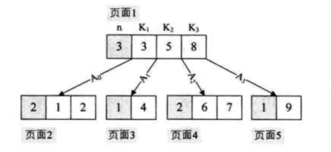
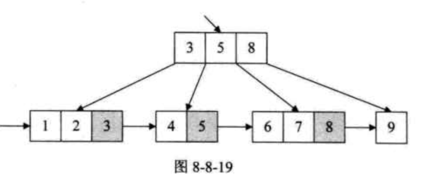

## 八大排序方法以及时间复杂度

-   排序算法稳定性定义：假定在待排序的记录序列中，存在多个具有相同的关键字的记录，若经过排序，这些记录的相对次序保持不变，即在原序列中，ri=rj，且ri在rj之前，而在排序后的序列中，ri仍在rj之前，则称这种排序算法是稳定的；否则称为不稳定的。

## 树结构

### 赫夫曼树

-   定义：带权路径之和长度最小的树称之为赫夫曼树
-   构造步骤：
    1.  根据给定的n个权值构成的n棵二叉树集合，其中任意一棵二叉树只有一个根节点
    2.  在集合中选取两颗根节点权值最小的树作为左右子树构造新的二叉树，注意左边放小的，右边放大的，构造后的二叉树根节点权值为左右子树根节点权值之和
    3.  在集合中删除这两棵树，并且将新的二叉树加入集合中
    4.  重复2-3，直到集合中仅含一棵二叉树为止，这颗二叉树就是赫夫曼树

### 赫夫曼编码

-   定义：设需要编码的字符集为{d1, d2, ... dn}，各字符集在电文中出现的次数频率集合相应为{p1, p2, ... pn}，则以d1、d2...dn作为叶子节点，以p1, p2 ... pn作为权重构造出一棵赫夫曼树，并规定赫夫曼树左支为0，右支为1，则从根节点到该叶子结点所经过路径的01序列就是该字符对应的最佳编码，成为赫夫曼编码

### AVL树（平衡二叉树）

-   定义：所有节点的左子树和右子树高度差 <= 1的二叉搜索树叫做AVL树

### 多路平衡查找树（B树）

-   特点：二叉树的一个节点有1个元素与2个值，B树突破了这个限制，一个m阶B树非叶子节点最多有m个孩子与m - 1个元素，这样元素储存数量就会极大的提升

-   一个m阶B树是有着以下属性的多路平衡查找树：
    -   如果根节点不是叶节点，则其至少有两颗子树
    -   每个非根分支节点都有k-1个元素和k个孩子，每个叶子节点都有k - 1个元素
    -   所有叶子节点都位于同一层次
-   作用：内外存数据交互作用

### B+树

-   B树缺点：如果中序遍历B树，那么就会进行多次页面置换操作，这无疑降低了B树的性能
-   如下图：要想中序遍历，则需要：页面1-- 页面2 -- 页面1 -- 页面3 -- 页面1 -- 页面4 -- 页面1 -- 页面5，能不能跳过这个环节，使得每个节点只被遍历一次呢？

-   B+树在B树上进行拓展，B+树把出现在双亲节点的元素会在孩子节点中又一次出现。另外，每一个叶子结点都会保存着一个指向后一叶子结点的指针。

## 图结构

### 最小生成树

-   定义：将n个节点，用n - 1条边把一个连通图连接起来，并使得权值的和最小，这就是最小生成树。

-   prim算法（贪心）
    -   流程：
        1.  任意设一个顶点为起始点，这里设v0为起始点，维护一个数组lowcost，lowcost[j]记录当前所得到的最小生成树与vj点的距离，adjvec[j] = i表示的是从vi到达vj；首先将v0加入最小生成树之中，即lowcost[0] = 0, adjvec[0] = 0
        2.  遍历v1-vn节点，找到一个与v0最近的节点k，并将加入最小生成树中（lowcost[k] = 0）
        3.  遍历v1-vn节点，看看剩下的没有加入最小生成树的节点里面，是否能够因为vk的加入使得最小生成树到达该节点的距离变小，如果有，则`lowcost[p] = G[k][p]`，并且`adjvec[p] = k`
        4.  循环直到所有节点都加入了最小生成树中
    -   复杂度O(n^2)
-   kruskal算法

### 最短路径

-   dijkstra算法
-   

## 栈

