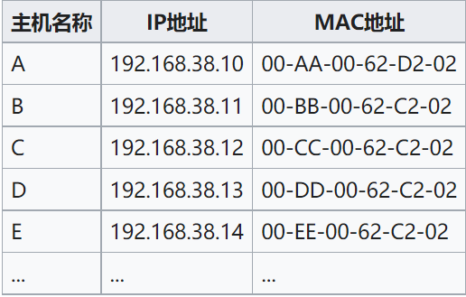
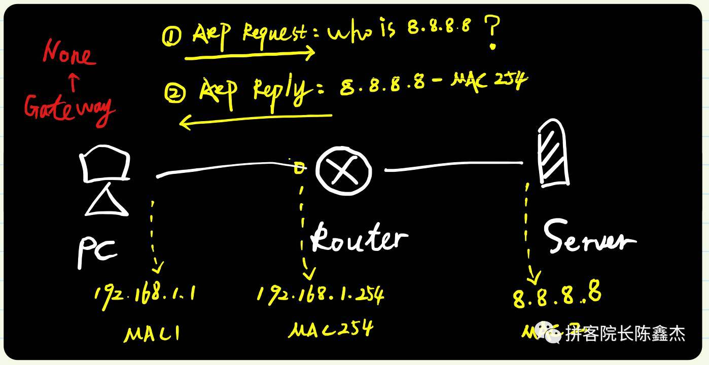
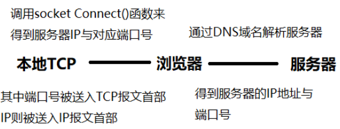
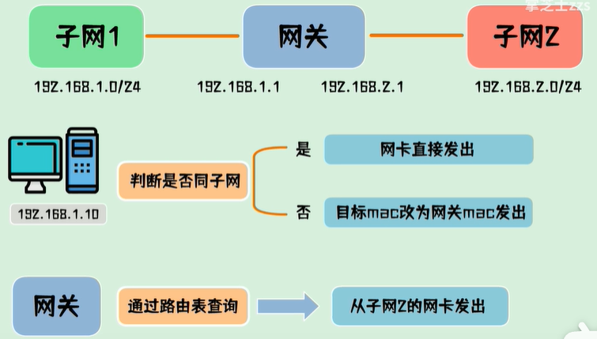
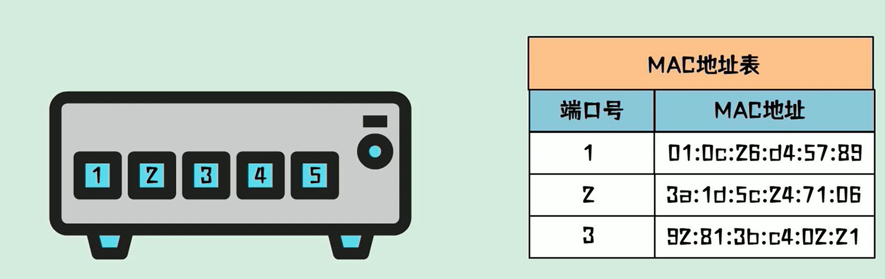
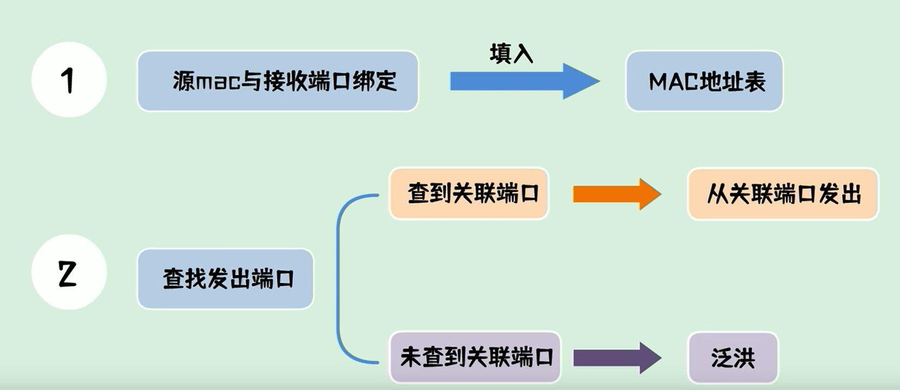
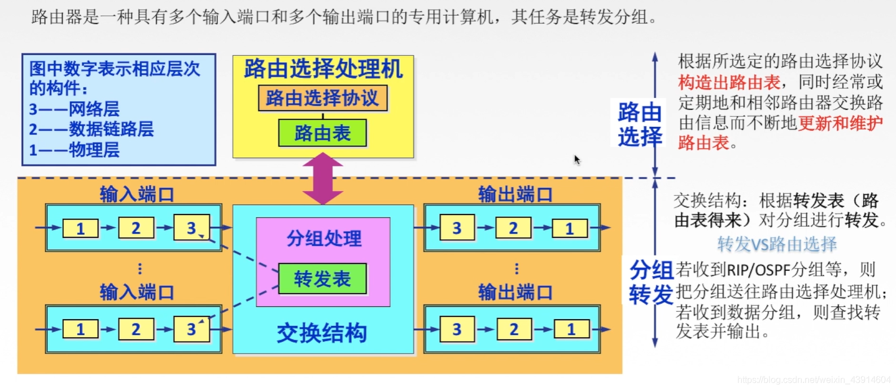

## OSI 7层模型以及作用

-   物理层

    -   作用：确保比特流可在各种物理媒体上透明传输
    -   重要设备：中继器、集线器
    -   传输单位：比特
-   数据链路层
    -   作用：主要是把网络层传下来的数据组装成帧
    -   以太网协议
    -   传输单位：帧
-   网络层
    -   作用：源主机到目的主机的数据分组路由与转发
    -   传输单位：数据报
-   传输层
    -   作用：进程-进程之间的数据传输
    -   传输单位：报文段（TCP）或用户数据段（UDP）
-   会话层
    -   作用：管理通信会话
-   表示层
    -   作用：数据处理，比如编码解码，加密解密
-   应用层
    -   作用：为计算机用户提供接口和服务

## TCP/IP 4层模型与各层主要协议

-   应用层：支持各种网络应用

    -   HTTP超文本传输协议
    -   HTTPS 
    -   FTP文件传输协议
    -   DNS域名解析服务器
    -   ssh
    -   telnet
    
-   传输层：进程-进程的数据传输，即端到端通信

    -   TCP

    -   UDP

- 网络层：源主机到目的主机的数据分组路由与转发

  - IP

  - ICMP、IGMP

-   数据链路层
    - 以太网帧协议
    
      -   作用：根据数据的MAC地址找到下一跳位置
      -   源地址与目的地址是MAC地址，48位，xx:xx:xx:xx:xx:xx
    
    -   ARP(地址解析协议)
    
        - 作用：用于IPV4，利用IP地址找到相应的MAC地址，IPV6将用NDP(Neighbor Discovery Protocol)来作为IP->MAC的协议
    
        - 原理：在每台安装有TCP/IP协议的电脑或路由器里都有一个ARP缓存表，表里的IP地址与MAC地址是一一对应的，如下表所示。
    
        - 例子：以主机A（192.168.38.10）向主机B（192.168.38.11）发送数据为例。
    
            > 1.当发送数据时，主机A会在自己的ARP缓存表中寻找是否有目标IP地址。如果找到就知道目标MAC地址为（00-BB-00-62-C2-02），直接把目标MAC地址写入[帧](https://zh.wikipedia.org/wiki/訊框)里面发送就可。
            > 2.如果在ARP缓存表中没有找到相对应的IP地址，主机A就会在网络上发送一个广播（ARP request），目标MAC地址是“FF.FF.FF.FF.FF.FF”，这表示向同一网段内的所有主机发出这样的询问：“192.168.38.11的[MAC地址](https://zh.wikipedia.org/wiki/MAC地址)是什么？”
            >
            > 3.网络上其他主机并不响应ARP询问，只有主机B接收到这个帧时，才向主机A做出这样的回应（ARP response）：“192.168.38.11的MAC地址是00-BB-00-62-C2-02”，此回应以单播方式。这样，主机A就知道主机B的MAC地址，它就可以向主机B发送信息。同时它还更新自己的ARP高速缓存（ARP cache），下次再向主机B发送信息时，直接从ARP缓存表里查找就可。
    
        - [代理ARP](https://www.cisco.com/c/zh_cn/support/docs/ip/dynamic-address-allocation-resolution/13718-5.pdf)（请跟网关的作用相区分）
    
            -   定义：当ARP请求目标跨网段时，网关设备收到此ARP请求，会**用自己的MAC地址**返回给请求者（善意的欺骗），这便是代理ARP（Proxy ARP）。
            -   举个例子：PC与server在不同的网段中，由于pc中的**ARP缓存表**中找不到IP=8.8.8.8对应的MAC地址信息，因此PC在它的网段中广播一个**ARP请求**：who is 8.8.8.8？由于默认情况下router不转发广播，因此server无法收到该广播，但是router知道8.8.8.8在另一个子网上，因此它发送了一个**ARP应答**，将server的MAC地址换成了自己的MAC地址，“欺骗了”PC，收到此应答后，PC更新了其ARP表，建立了IP->MAC的映射关系
            -   网关：同样的事情，当电脑有网关时，如果PC发现server不在自己所在的网段中，就会将数据包发送给网关，
    
    -   ATM

## 简述一下TCP的三次握手过程

-   客户端发送序列号为x，SYN=1的连接请求报文，同时进入SYN_SENT状态

-   服务器接收到该报文后，发送序列号为y，确认号为x+1，SYN = 1, ACK = 1的报文，同时进入SYN_RECV状态

-   客户端收到该报文后，发送序列号为x+1，确认号为y+1， ACK = 1的报文，同时进入ESTABLISHED状态

-   服务器接收到该报文后，也进入ESTABLISHED状态

## 为什么需要三次握手而不是两次握手？

-   主要防止**已失效的连接请求报文**突然又传到了服务器，从而产生错误。假设这种场景：客户端发送第一个请求报文，但是该报文遭遇网络阻塞，迟迟没办法到到服务器，那么客户端以为服务器没收到，此时重新向服务器发送这条报文，经过两次握手后，建立了连接。当断开连接后，滞留的报文终于到达了服务器，服务器以为客户端又一次发送连接请求，白白消耗了服务器资源。

## 如果已建立了连接，但是客户端出现故障会怎么样？

-   服务器有一个保活计时器，每次收到客户端的数据时都会重新计时。通常时间为2个小时。如果2个小时后，还没有收到客户端数据，那么就会每隔75s发送一次探测报文，如果10次客户端仍然没有反应，那么就会关闭连接。

## 什么是半连接队列？什么是全连接队列？

-   半连接队列：又叫做syn队列，客户端发送连接请求报文SYN = 1，服务端收到后回复SYN+ACK后，服务端进入SYN_RCVD状态，这个时候的会把客户端的socket（IP + 端口）放到半连接队列。

-   全连接队列：当服务端收到客户端的ACK后，socket会从半连接队列移出到全连接队列。当调用accpet函数的时候，会从全连接队列的头部返回可用socket给用户进程。

## 在第二次握手时，如果客户端一直没有回复确认报文，假设有很多这种情况发生，这时候会出现什么问题？

### SYN攻击

-   原理：制造大量虚假的IP地址，发送大量的半连接请求，服务器的半连接队列（SYN backlog队列）被占满，正常的SYN请求被丢弃，使得服务器阻塞甚至瘫痪。

-   怎样检测？
    -   当在服务器上看到大量半连接请求时，特别是源IP地址是随机的，基本上可以判定这是一次SYN攻击

-   怎样预防？
    -   增加半连接队列空间大小

    -   缩短超时时间

    -   SYN cookies技术
        -   当backlog队列已满，服务器并不拒绝收到新的SYN连接请求时，而是直接回复一种特殊的序列号的包，即cookie（序列号）给客户端，如果收到客户端的ACK包，那么通过客户端的确认号 - 1得到cookie，对比本次的cookie与上次发送的cookie值是否相同，若相同，直接分配资源与客户端连接。

        -   cookie：根据客户端的IP地址、端口、服务器的IP地址、端口等进行hash运算，加密得到的一串序列号。

## 简述一下TCP的四次挥手过程

-   客户端发送序列号为x，FIN = 1的连接释放报文，同时进入FIN_WAIT_1状态

-   服务器接收到该报文后，发送序列号为y，确认号为x+1，ACK = 1的报文，同时进入CLSOE_WAIT状态，等待服务器发送完最后的数据

-   客户端接收到该报文后，进入FIN_WAIT_2状态

-   服务器在一段时间后，发送完了最后的数据，那么发送序列号为z，确认号为x+1，FIN = 1的连接释放报文，进入LAST_ACK状态

-   客户端接收到该报文后，发送序列号为x+1，确认号为z+1，ACK = 1的报文，同时进入TIME_WAIT状态。即等待2个最长报文生存周期，确认服务器已经接受到该报文后，进入CLOSED状态

-   服务器接收到该报文后，进入CLOSED状态

## 简述TIME_WAIT状态

-   TIME_WAIT在四次挥手客户端上发生。在客户端发送出最后的确认报文，由于网络情况的不稳定，该报文可能丢失。服务器如果没有收到确认报文，将不断重复发送连接释放报文。所以客户不能立即关闭，它必须确认服务器接收到了该确认报文。客户端会在发送出确认报文之后进入到TIME_WAIT状态。客户端会设置一个计时器，等待2MSL的时间。如果在该时间内再次收到FIN，那么Client会重发ACK并再次等待2MSL。如果直到2MSL，Client都没有再次收到FIN，那么Client推断ACK已经被成功接收，则结束TCP连接。
-   MSL：最大报文生存时间，任何报文超过该时间都会被丢弃

## TIME_WAIT状态只能在客户端吗？服务器有没有可能出现这种状态？

有可能。在短连接情况下，在四次挥手时，当服务器收到客户端发送的FIN连接释放报文时，当服务器没有数据要传输给客户端时，就会直接发送ACK + FIN给客户端，这时服务器进入TIME_WAIT状态，等待客户端的ACK报文到来

## 有没有一个场景，ACK + 数据 + FIN这个包一起发给客户端？

-   有，当服务器没有数据发给客户端时，就直接将ACK+FIN一次性传给了客户端，此时就是3次挥手了

## TCP连接的可靠性

-   基于连接的，有序列号、确认号、超时重传机制

-   滑动窗口机制

    -   目的：为了实现多个数据同时发送，提高数据传输效率，又能够保证数据传输的可靠性

    -   原理：接收方不仅回复确认号y，还回复当前接受方的窗口大小m，则发送方可以根据这两个信息计算出下次可以发送的字节数。(假设发送方已经发送了x字节，那么还可以发送m - (x - (y - 1))，其中x - (y - 1)代表的是发送方已经发送了的但是接受方还没有收到的

    -   场景：如果接收方有一个序号的包没收到，那么滑动窗口会怎样变化？
        -   答：假设没有被收到的包序列号为x，那么对于发送方，在窗口内，未发送的数据允许被继续发送，在收不到x的ack之前，窗口不会向前推进，如果发送方接收到了3个相同的ACK，那么就会重传下一个包，直到收到了序列为x的包的ack，窗口就继续向前推进。
    
-   拥塞控制
    -   目的：防止过多的数据注入到网络中，使得网络中的路由器或链路过载

## 拥塞控制有哪些？

-   慢启动：当开始发送数据时，拥塞窗口cwnd从1开始，指数型扩大（慢是指每次发送方开始传输数据时，拥塞窗口cwnd都要从1开始）
-   快重传：要求接收方收到数据时要立即发送确认报文，而不是等待自己的数据捎带确认，只要发送方收到3个重复确认，就立即重传丢失的包M3

-   拥塞避免：当cwnd > ssthresh时，让拥塞窗口线性增大，即每经过一个RTT（往返时延）就将cwnd + 1（当出现超时时，会让ssthresh = 1/2 cwnd，同时设置cwnd = 1，慢启动开始）

-   快恢复：发送方通过3个重复确认知道接收方只是丢失了个别报文，并没有出现网络拥塞，所以调整sstresh = 1/2 cwnd，但是并不执行慢启动算法。
-   怎样判断网络拥塞？
    -   只要发送方没有按时收到应当到达的确认报文，也就是说，出现了超时，就可以猜想网络出现了拥塞。

## 域名、IP地址、MAC地址的区别？

-   域名地址：[www.baidu.com](http://www.baidu.com/)
    -   处于应用层

-   IP地址：
    -   处于网络层

-   MAC地址：

    -   处于数据链路层

    -   又叫做物理地址，这个地址都被写在网卡的ROM中，让每台计算机在网络上都有一个独一无二的MAC地址。一般来说是48位，可用12位16进制表示就是：xx:xx:xx:xx:xx:xx，

    -   有了IP地址，为什么还要用到MAC地址？
        -   这是因为，IP地址能够被人随意更改，因此单独的IP地址无法作为用户的身份标识，而MAC地址则不同，理论上说，除非硬件被盗用，否则没有办法冒名顶替的，因此，IP地址+MAC地址这一组合，解决了IP被盗用问题。

## TCP报文首部仅有端口号，没有IP地址，是如何跟服务器进行通讯的呢？

-   实际上，已经得到了服务器IP，只不过封装到了IP报文的首部中，这就是分层思想，传输层只需要知道端口就行，至于IP，那是你网络层的事儿，跟我无关

## TCP与UDP的区别？

-   TCP是可靠的，UDP尽最大努力交付，但是不保证可靠（包括:TCP保证数据可靠有序，不丢不重，但是UDP不行）
-   TCP是基于连接的；UDP只管发送，不管你收不收得到
-   每一条TCP连接只能是点对点的（即主机-主机），而UDP支持一对一、一对多、多对多
-   TCP对系统资源要求较多，UDP较少
-   TCP首部为20B，而UDP首部开销为8B，开销少
-   TCP面向字节流，UDP面向报文

## 什么是HTTP协议？

-   HTTP即超文本传输协议，定义了客户端怎样向服务器发送文档请求，以及服务器怎样把文档传给客户端，这种请求和相应遵循的规则就是HTTP协议。

-   HTTP协议下，数据传输流是怎样的？

## 常见的HTTP状态码有哪些？

| 状态码 |               含义                |
| :----: | :-------------------------------: |
|  200   |   请求的资源（网页等）请求成功    |
|  301   | 资源（网页等）被永久转移到其他URL |
|  404   |    请求的资源（网页等）不存在     |
|  500   |          内部服务器错误           |

## HTTP与HTTPS有什么区别？

-   HTTP协议是以明文的方式在网络中进行传输数据的，而HTTPS数据是经过TLS与SSL加密过后的，因此HTTPS具有更高的安全性

-   HTTPS协议需要服务端申请证书，浏览端安装对应的根证书，HTTP不用

-   HTTP协议的端口号是80， HTTPS协议的端口号是443

## HTTPS优点

-   由于传输的是被加密过后的数据，所以保证了数据安全
-   HTTPS可以认证用户与服务器，从而保证数据发送到正确的用户与服务器上
    -   服务端需要回复数字证书，经过客户端验证，才能够进行下面的一系列操作

## HTTPS缺点

-   握手阶段延时较高：由于HTTPS在会话之前还要进行TLS/SSL握手，因此握手阶段延时较高

-   HTTPS部署成本比较高：CA证书需购买，解密计算占用CPU资源

## HTTPS加密原理？ / TLS/SSL握手过程？

-   第一步，客户端给出协议版本号、一个客户端生成的随机数（Client random），以及客户端支持的加密方法。
-   第二步，服务器确认双方使用的加密方法，并给出数字证书、以及一个服务器生成的随机数（Server random）。
-   第三步，客户端确认数字证书有效，然后生成一个新的随机数，也就是预主秘钥（Premaster key），并使用数字证书中的公钥，加密这个随机数，发给服务器。
-   第四步，服务器使用自己的私钥，获取客户端发来的随机数（即Premaster secret）。
-   第五步，客户端和服务器根据约定的加密方法，使用前面的三个随机数，生成"对话密钥"（session key），用来加密接下来的整个对话过程。

## HTTPS采用什么加密方法？

-   混合加密，即对称密钥加密 + 非对称密钥加密，其中：
    -   对称密钥加密：加密与解密是同一把密钥；特点：安全性低，但是效率高；
    -   非对称密钥加密：有公钥与私钥两把钥匙。公钥加密的文件需要利用私钥解密；特点：安全性高，但是效率低；
-   HTTPS采用混合加密，综合它们两者的优点
    -   首先在交换密钥的环节中，客户端利用非对称密钥，加密对称密钥，这条密钥发送给服务器，服务器利用自己的私钥来解密这个对称密钥，这样就安全的获得了对称密钥
    -   在数据交换环节中，双方利用已安全得知的对称密钥（对话密钥），利用对称密钥加密，来加密整个对话过程
-   为什么要这样做？
    -   交换密钥环节利用非对称密钥保障了对称密钥的安全性
    -   交换数据环节利用对称密钥加密，效率高

## 在浏览器中输入网址：[www.baidu.com](http://www.baidu.com/)发生了什么？都在哪一层？调用了什么协议？

1.  浏览器通过域名利用DNS服务器解析出了该域名对应的IP地址，这个过程是在**应用层**进行的，用到的协议有DNS
    -   首先先查看本地是否有该域名对应的IP缓存
    -   在本地DNS服务器里面去寻找
    -   在根DNS服务器里面去找
    -   国际顶级DNS服务器里面去寻找
2.  浏览器与服务器通过3次握手，建立TCP连接，这个过程是在**传输层**，用到的协议有**TCP协议**（如果使用的是HTTPS，会多一个SSL握手）
3.  接着，浏览器给服务器发送一个HTTP会话请求，这个过程是在应用层，用到的协议是**HTTP协议**
4.  服务器响应HTTP请求，同上
5.  浏览器进行渲染

## 什么是域名服务器（DNS）？

-   域名服务器是进行域名与对应的IP地址转换的服务器，里面保存着一张域名与IP映射表
-   域名类型：

    -   国际顶级域名：.com/.net/.org

    -   国内顶级域名：.cn/.us/.jp
-   路由器怎样知道收到的包发往哪边？
-   服务器发送的包怎样获取到服务器的地址？采用什么协议获取的呢？

## 什么是DHCP？

- DHCP指的是由服务器控制一段IP地址范围，客户机登录服务器时就可以自动获得服务器分配的IP地址和子网掩码。提升地址的使用率。

## 什么是端口、端口号？

- 端口：端口包括物理端口和逻辑端口。物理端口是用于连接物理设备之间的接口，逻辑端口是逻辑上用于**区分服务**的端口。TCP/IP协议中的端口就是**逻辑端口**，通过不同的逻辑端口来区分不同的服务。

- 端口号作用：可以在一台主机上，唯一标识一个服务（进程）。一台电脑可以提供多种服务，比如Web服务、FTP服务、SMTP服务等，这些服务完全可以通过1个IP地址来实现。那么，主机是怎样区分不同的网络服务呢？显然不能只靠IP地址，因为IP 地址与网络服务的关系是一对多的关系。实际上是通过“IP地址+端口号”来区 分不同的服务的。

- 端口号分类

  - 公认端口（Well-Known Ports）

    > 这类端口也常称之为"常用端口"。这类端口的端口号从0到1023，它们紧密绑定于一些特定的服务。通常这些端口的通信明确表明了某种服务的协议，这种端口是不可再重新定义它的作用对象。
    >
    > 80：端口实际上总是HTTP通信所使用的
    >
    > 443：是HTTPS服务的端口号
    >
    > 22：是SSH的端口号
    >
    > 23：是Telnet服务专用的。

  - 注册端口（Registered Ports）

    > 端口号从1025到49151。分配给用户进程或应用程序。这些进程主要是用户选择安装的一些应用程序，而不是分配好的公认端口的常用程序。

## IP地址、子网掩码、网关、路由器、交换机

- 子网掩码：
  - 功能：划分不同的网段。子网掩码将IP地址划分为两大部分：网络号：主机号，具有相同网络号的属于相同的子网，其中的各个主机能够联结起来进行通信。可用交换机互联起来
  - 形式：共有32位。分为8位.8位.8位.8位，一般用10进制来表示，0-255，如果32位对应的位设为1，表示这是属于网络号，反之属于主机号。255.255.255.0表示的是这个网段可以有256-2=254个IP地址，注意主机号不能全0或全1
- 网关
  - 作用：实现将不同子网（网段）之间的主机通信。TCP-IP协议表示，不同子网之间是不能够进行通信的，即使是两个网络连接在同一交换机（集线器）上，如果没有网关，它们也不能通信。如果要通信，需要通过网关进行转发。
  - 例子：
    1. 网关有两张网卡，分别对应2个IP属于不同的子网，首先，子网1中的192.168.1.10这台PC通过将子网掩码&目标IP来确认目标IP是否与自己是同一子网
    2. 如果在同一子网，则数据包从网卡直接发出
    3. 如果不在同一子网，则PC会修改目标MAC地址（由于不知道，默认是00.00.00.00）为网关MAC地址，然后发送给网关，网关拿到这个数据包后，查询路由表（还是通过子网掩码&IP地址==0来判断？），发现这个数据包的网段属于子网2，网关修改目标MAC地址为计算机B的MAC地址，修改源MAC为自己的MAC，然后从网关的子网2的网卡发出。
  - 网关设备：包括路由器、无线路由器、多层交换机、防火墙等设备
  - 默认网关：一台主机可以有多个网关。默认网关的意思是一台主机如果找不到可用的网关，就把数据包发给默认指定的网关，由这个网关来处理数据包。

- 交换机（由于交换机之关系MAC地址，因此被称为二层设备）
  - 作用：根据数据包中的目标MAC地址，查询MAC地址映射表，找到对应的物理端口。查询端口时会出现两种情况，如果查到关联端口，从关联端口发出，否则就会群发，称之为泛洪

​                                       

## 路由器相关问题

### 数据交换的一种方式-分组交换

-   定义：将大的数据块分割成小的数据块，再将每个数据段前面需要加上必要的控制信息，作为数据段首部，这样每个带有首部的数据段就构成了一个分组
    -   首部：包括目的IP地址与源IP地址、分组标号
-   优点：
    -   无建立时延，不需要建立专用的通信线路，用户随时可以发送分组
    -   线路利用率高，通信双方不是固定占有一条通信线路，并且可以在不同时段一段一段发送数据
    -   减少了重发数据量。分组使得数据一次性传输较少，如果出错重发数据量会大大下降
-   缺点：
    -   存在传输时延，比如说在路由器中
        -   当一个分组正在查询转发表时，后面又紧跟着一个另一个分组，那么这个后道的分组就需要在队列中等待
        -   当交换结构中传出来的分组速率超过了输出链路的发送速率时，来不及发送的分组需要暂存在队列中等待
    -   需要传输额外的信息量
        -   源地址 + 目的地址 + 分组编号

### 分组转发算法（P134 + 图4-17）

1.  从数据报的首部提取目的主机的 IP 地址 D, 得出目的网络地址为 N。（注：网络地址 = IP地址 & 子网掩码）
2.  若网络 N 与此路由器直接相连。则把数据报**直接交付**目的主机 D。否则是**间接交付**，运行(3)。
3.  若路由表中有目的地址为 D 的**特定主机路由**。则把数据报传送给路由表中所指明的下一跳路由器。否则，运行(4)。
4.  若路由表中有到达网络 N 的路由，则把数据报传送给路由表指明的下一跳路由器。否则，运行(5)。
5.  若路由表中有一个**默认路由**。则把数据报传送给路由表中所指明的默认路由器；否则，运行(6)。
6.  报告转发分组出错。 

### 路由器结构组成

-   作用：跨网段的数据传输与转发 
    -   路由器本身都有**2个不同的IP地址**，对应着不同的网段，**由于同一个子网段的不同主机是可以进行通信的**，因此当IP数据报来临时，当IP数据报首段中的主机IP是路由器直连的另一个网络地址时，那么路由器就可以直接交付；否则就需要经过路由器转接到另一个路由器上或者默认路由器上，最终实现跨网段数据传输与转发
    -   注：处于同一子网的不同主机，其网络地址相同，即IP1 & 子网掩码 = IP2 & 子网掩码 = ...
-   包括两大部分：**路由选择**与**分组转发**
    -   路由选择：构造路由表，路由表是通过路由选择算法得到的
    -   分组转发：通过分组转发算法，完成直接交付或间接交付

### 请详细说明从源主机H1向目的主机H2发送分组后查找路由表的过程P140

